---
# 为什么学习这本书

## 很多东西并不像看起来那样简单

比如：

- 算法性能分析结果$\neq$实际程序性能（底层实现问题）
- 计算机系统中的算术$\neq$数学中的算术（溢出问题）

我们知道，在纸面上看
$$
		 (x+1)^2≥0 
$$


是一定的，但是在计算机中就不一定了，比方说：

```cpp
$ lldb
(lldb) print (233333 + 1) * (233333 + 1)
(int) $0 = -1389819292
```

这就是整数的溢出，当然用浮点数的表示方法可以避免溢出，但是浮点数有精度问题

```cpp
# dawang at wdxtub.local in ~ [9:05:02]
$ lldb
(lldb) print (1e20 + -1e20) + 3.14
(double) $0 = 3.1400000000000001
(lldb) print 1e20 + (-1e20 + 3.14)
(double) $1 = 0
```

## 你了解内存吗？

我们都学过的`C或者C++`都没有提供任何内存保护机制，再加上强大且危险的指针，出现溢出或者段错误实在是家常便饭。这类问题的问题在于，很难确定是程序本身的问题，还是编译器或者系统的问题。

很多著名网站都是由于内存错误『引发』的，比方说` stackoverflow 和 segmentfault`。虽然现代编程语言大多采用了比较完善的内存保护的机制，但是从 C 时代流传下来的这些错误名称则随着时间推移成为了经典，颇有『为人不识 XX 兰，阅尽 XX 也枉然』的既视感。

---

接下来，ics(immediate commit suicide——立即自杀)，你准备好了吗？

# 信息的表示和处理

## 信息存储

- 最小的可寻址的内存单元：`字节`(8位的块)
- 机器级程序将内存视为一个非常大的字节数组，成为`虚拟内存`(`virtual memory`)
- 内存的每个字节都由一个唯一的数字来表示，成为它的`地址`(`address`).
- 所有可能地址集合就称为`虚拟地址空间`(`virtual address space`)

字节用十六进制表示。

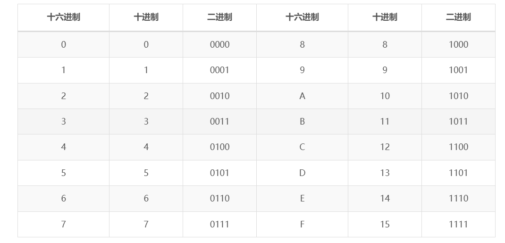

### 字数据大小

- `字长`:每台计算机都有一个字长(word size)，指明指针数据的标称大小。

解释：因为虚拟地址是以这样的一个字来编码的，所以字长决定的最重要的系统参数就是虚拟地址空间的最大大小，也就是说，对于一个字长为w位的机器而言，虚拟地址的范围为

​							$$0 \sim 2^w-1$$

程序最多访问

​							$$2^{w}$$

字节。

>字长（word size）指的是计算机处理器在一次运算或数据处理操作中，能够同时处理的二进制位数。字长直接决定了处理器在一条指令中可以处理的数据量的大小，影响了计算机的性能、存储容量和指令集设计。
>
>### 字长的具体表现：
>
>1. **处理器处理数据的能力**：字长决定了CPU一次能够处理的二进制位数。例如，32位处理器一次能处理32位二进制数据，而64位处理器一次能处理64位二进制数据。
>
>2. **内存寻址能力**：字长影响处理器能够寻址的内存空间大小。例如，在32位处理器中，最大可寻址内存为2^32个字节（即4GB）；而在64位处理器中，最大可寻址内存空间可达到2^64个字节，理论上是非常庞大的（实际上因其他技术因素限制通常不到此上限）。
>
>3. **指令集架构（ISA）**：字长决定了处理器的指令宽度，影响了指令的格式、寄存器大小以及数据操作方式。例如，64位指令集架构（如x86-64）会包含针对64位寄存器的操作指令，而32位指令集架构（如x86）只能处理32位的寄存器。
>
>4. **性能**：较大的字长意味着处理器能够在一次运算中处理更多的数据，通常会提高程序的运行效率。然而，实际的性能提升还取决于应用程序和操作系统是否能够充分利用这种大字长。
>
>5. **硬件设计**：字长影响到计算机硬件设计中的其他部分，比如寄存器、总线、ALU（算术逻辑单元）等的设计。字长越大，通常硬件的复杂性、成本和功耗都会增加。
>
>### 常见的字长：
>
>- **8位**：早期的微处理器通常为8位，如Intel 8080。
>- **16位**：如Intel 8086，广泛用于20世纪80年代。
>- **32位**：如Intel 80386、ARM Cortex-A32等，现代计算机中曾经非常流行。
>- **64位**：现代计算机的主流字长，常见于x86-64、ARM64架构的处理器中。
>
>总结来说，字长是计算机体系结构中一个重要的指标，它不仅影响处理器的设计，还影响到整个计算机系统的性能和使用体验。

### 寻址和字节顺序

在几乎所有机器上，多字节对象都被存储为连续的字节序列，对象的地址为所使用字节的`最小的地址。`

排列表示对象的两个通用规则：

考虑一个`w`位的整数，位表示为

​		$$[x_{w-1},x_{w-2},…,x_{0}]$$

- 最高有效位:


$$
x_{w-1}
$$

- 最低有效位
  $$
  x_{0}
  $$

假设w是8的倍数，这些位就能被划分为字节，其中`最高有效字节`包含位
$$
[x_{w-1},x_{w-2},…,x_{w-8}]
$$
`最低有效字节`
$$
[x_{7},x_{6},…,x_{0}]
$$
排序规则：

- `小端法`:某些机器选择在内存中按照从最低有效字节到最高有效字节的顺序存储对象
- `大端法`:另一些机器则按照从最高有效字节到最低有效字节的顺序存储

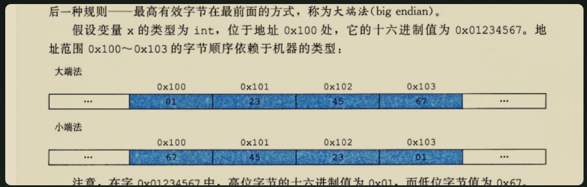

### C语言中的位级运算

- 与 And：`A=1` 且 `B=1` 时，`A&B = 1`
- 或 Or：`A=1` 或 `B=1` 时，`A|B = 1`
- 非 Not：`A=1` 时，`~A=0`；`A=0` 时，`~A=1`
- 异或 Exclusive-Or(Xor)：`A=1` 或 `B=1` 时，`A^B = 1`；`A=1` 且 `B=1` 时，`A^B = 0`

### C语言中的逻辑运算

- 逻辑与 And：`A`非零且`B`非零时，`A&&B`为非零值；否则为零。

- 逻辑或 Or：`A`非零或`B`非零时，`A||B`为非零值；否则为零。
- 逻辑非 Not：`A`非零时，`!A`为零；`A`为零时，`!A`为非零值。

### C语言中的移位运算

- 左移：x<<k表示x向左移动k位，丢弃最高的k位，并在右端k位
- 逻辑右移: 左端补k个0，右端丢弃k位
- 算术右移：左端补k个1,右端丢弃k位

## 整数表示

整数分为无符号和有符号

无符号的直接用原码表示

有符号的用补码表示

- $$B2U_{w}(\overrightarrow x)=\sum_{i=0}^{w-1}2^i$$(二进制转换成无符号整数)
- $$B2T_{w}(\overrightarrow x)=-x_{w-1}2^{w-1}+\sum_{i=0}^{w-2}2^i$$其中 `x_(w-1)` 是符号位。符号位为 1 表示负数，0 表示正数。补码形式便于计算和表示负数。这样设计是为了简化硬件加法器的实现，使得减法操作可以通过加法（和补码转换）来完成。
- $$U2B_{w}$$的反函数是$$B2U_{w}$$
- $$T2B_{w}$$的反函数是$$B2T_{w}$$

### 整型表示的特点

接下来我们看看这种表示形式的特点，以及溢出的集中情况，假设字长为 `w`，定义如下的常量：

- UMin = 0 即 000…0
- UMax = 2w−12w−1 即 111…1
- TMin = −2w−1−2w−1 即 100…0
- TMax = 2w−1−12w−1−1 即 011…1
- Minus 1 即 111…1

这里的 U 表示无符号数，T 表示补码(Two’s Complement)，对于字长为 16 的情况来说，我们有：

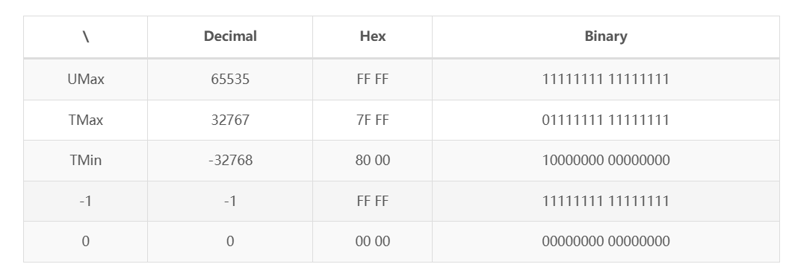

对于不同的 word size，数值也会有很大的变化

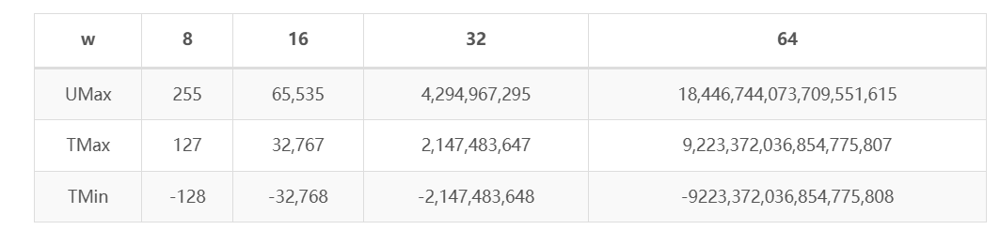

观察可以得知两个很重要的特性

- |TMin| = TMax + 1 (范围并不是对称的)
- UMax = 2*TMax + 1

### 类型转换

$$
T2U_{w}(x)=B2U_{w}(T2W_{w}(x))=\begin{cases}x+2_{w},\,\,x<0\\ x,\ x\geq0\end{cases}
$$

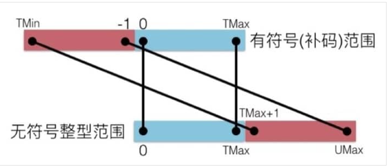

在进行有符号和无符号数的互相转换时：

- 具体每一个字节的值不会改变，改变的是计算机解释当前值的方式
- `如果一个表达式既包含有符号数也包含无符号数，那么会被隐式转换成无符号数进行比较`

例如：

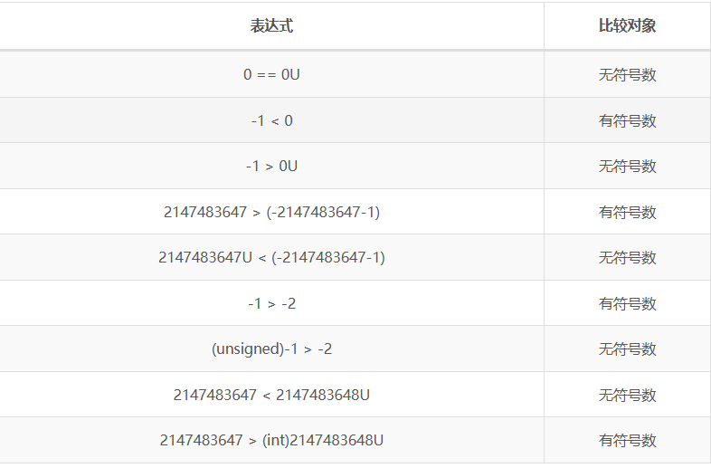

### 类型扩展和截取

- 扩展（例如从`short int`到`int`）
  - 无符号数：加 0
  - 有符号数：加符号位

证明:

​	原数=$$-x_{w-1}2^{w-1}+\sum_{i=1}^{w-2}x_{i}2^{i}$$

​	转换后=$$-x_{w-1}*2^{w^{'}-1}+\sum_{i=1}^{w^{'}-2}x_{i}2^{i}$$

转换后-原数=$$x_{w-1}2^{w-1}-x_{w-1}*2^{w^{'}-1}+\sum_{i=w-1}^{w^{'}-2}x_{i}2^{i}=0$$

- 截取(例如`unsigned`到`unsigned short`,对于小的数字可以得到预期结果)
  - 无符号数：`mod`操作$$x^{'}=x\ mod\ 2^{k}$$
  - 有符号数:近似`mod`操作$$x^{'}=U2T_{k}(x\ mod\ 2^{k})$$

举个例子

```cpp
short int x = 15213;
int ix = (int) x;
short int y = -15213;
int iy = (int) y;
```

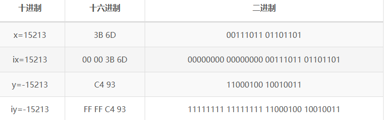

## 整数运算

- 为什么正数相加会得出负数
- 为什么x<y和比较表达式x-y<0会产生不同的结果？

### 无符号加法

$$+_{w}^{u}$$该操作吧整数和x+y截断为w位得到的结果
$$
x+_{w}^{u}y=(x+y)mod\ 2^{w}
$$
假设 `w=3`，那么能够表达的数字范围是 `000~111(0~7)`（括号内为二进制对应的十进制数值，后同），那么如果一个表达式是 `110+111(6+7)`，原本应该等于 `1101(13)`，但是由于 `w=3`，所以最终的结果是 `101(5)`，也就是发生了溢出，两个无符号数相加，反而变『小』(检测是否溢出的充要条件)。

### 补码加法

仍然是截断为w位
$$
x+_{w}^{t}y=\begin{cases}
x+y-2^{w},\ 2^{w-1}\le x+y\ 正溢出 \\  
\ x+y,\ -2^{w-1}\le x+y < 2^{w-1}\ 正常\\
\ x+y+2^{w},\ x+y<-2^{w-1}\ 负溢出
\end{cases}\ \ \ \ \ \ \ \ \ \ \ =U2T_{w}[(x+y)\ mod\ 2^{w}]
$$
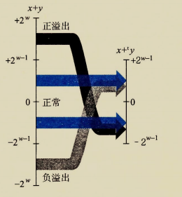

`两个数w位补码之和与无符号之和有完全相同的位级表示。实际上，大多数计算机使用同样的机器指令来执行无符号或者有符号加法`

检测条件：s=x+y,当且仅当x>0,y>0,但
$$
s\le 0
$$
时，计算s发生了正溢出。当且仅当x<0,y<0,但
$$
s\geq 0
$$
计算s发生了负溢出

还是用刚才 `w=3` 作为例子，能够表达的数字范围是 `100~011(-4~3)`，如果一个表达式是 `011+010(3+2)`，理论上应该等于 5，但是相加之后变成了 `101(-3)`，也就是发生了正溢出。如果一个表达式是 `100+101(-4+(-3))`，理论上应该等于 -7，但是相加后进位截取变成了 `001(1)`，也就是发生了负溢出。

### 乘法

- 无符号乘法：$$x*_{w}^{u}=(x·y)\ mod\ 2^{w}$$
- 有符号乘法:$$x*_{w}^{t}y=U2T((x·y)\ mod\ 2^{w})$$

这是因为无符号和补码乘法的位级等价性。

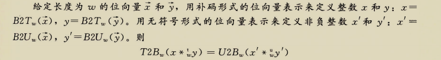

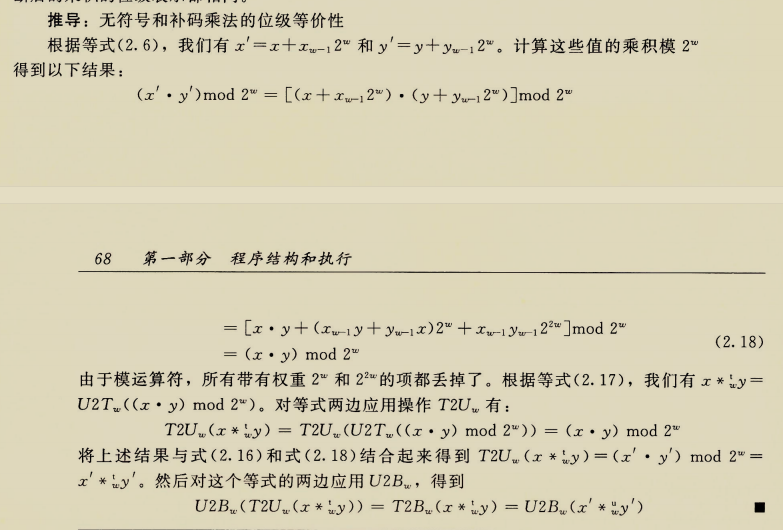

- 例子：

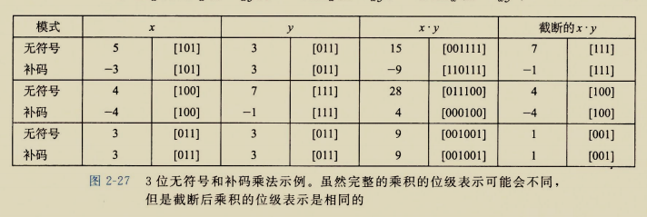

### 

