# 条件码

**条件码寄存器**（Condition Code Register），在 x86-64 架构中，也被称为 **EFLAGS 寄存器**，用于存储 CPU 执行算术或逻辑运算后的状态信息。这些状态信息由一组 **条件码**（condition flags）表示，通常用于判断运算结果并进行条件分支跳转。

### 条件码寄存器的主要用途：

- **保存运算结果的状态**：每当 CPU 执行加法、减法、乘法、除法、比较等运算时，条件码寄存器会根据运算结果自动更新某些标志位。
- **用于条件跳转**：汇编中的条件跳转指令（如 `jz`、`jnz`、`jl` 等）通过检查条件码寄存器中的标志位来决定程序执行的下一步操作。

### 主要的条件码标志位：

条件码寄存器中有几个位用于表示算术或逻辑操作后的状态，以下是最常见的几个标志位：

>
>
>条件码是隐式设置的，即不需要一条指令设置条件码，其在算术运算后自动设置（带来的电路的增多）

1. **CF（Carry Flag，进位标志）**：
   - 在无符号运算中，进位标志用于表示加法时最高位发生了进位或减法时借位。
   - **置位条件**：如果执行加法时有进位，或减法时发生了借位，则 CF 被设置为 1。
   - **使用场景**：无符号运算中的溢出检测。
   - **C语言表示**：`(unsigned)   t<(unsigned)  a`
2. **ZF（Zero Flag，零标志）**：
   - 用于表示操作结果是否为零。
   - **置位条件**：如果运算结果为零，则 ZF 被设置为 1。
   - **使用场景**：在判断某个值是否为零时非常有用。例如，条件跳转指令 `jz`（跳转如果零）和 `jnz`（跳转如果非零）使用此标志。
   - **C语言表示**:`t==0`
3. **SF（Sign Flag，符号标志）**：
   - 用于表示操作结果的符号位，专门用于有符号数的运算。
   - **置位条件**：如果运算结果为负，SF 被设置为 1；如果为正，则 SF 为 0。
   - **使用场景**：判断结果是否为负数，在有符号运算时常用。
   - **C语言表示**:`t<0`
4. **OF（Overflow Flag，溢出标志）**：
   - 用于表示有符号运算中是否发生了溢出。
   - **置位条件**：如果加法或减法导致了有符号数的溢出（即结果超过了能表示的范围），则 OF 被设置为 1。
   - **使用场景**：用于检测有符号运算中的溢出情况。
   - **C语言表示**:`(a<0==b<0)&&(t<0!=a<0)`

## CMP和TEST指令

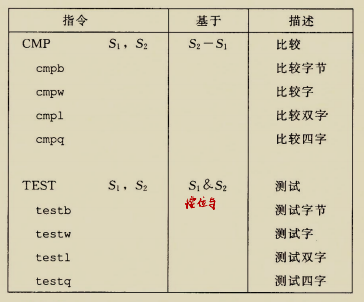

- CMP指令除了不存结果到目的寄存器外，其他与SUB指令一样
- TEST同样除了不存结果到目的寄存器外，其他与AND指令一样

举个例子:

```
testq %rax,%rax   //检测%rax是否为0，当%rax为0时，ZF为1
```


## 访问条件码

我们使用SET指令类来访问条件码

**注意**

- SET指令的目的操作数是低位单字节寄存器或是一个字节的内存位置。将该字节设置为0或1
- 其他字节不变！

所以如果要读入整个寄存器或者半个寄存器，要注意对高位清零。

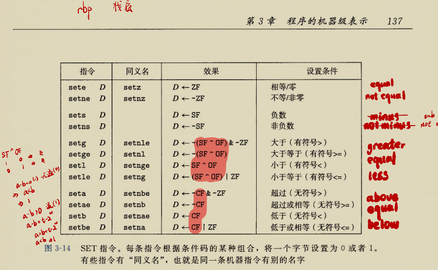

注意有符号和无符号的指令的区别

- setge的解释

| SF   | OF   | SF^OF       |
| ---- | ---- | ----------- |
| 0    | 0    | 0           |
| 0    | 1    | 1(负溢出)   |
| 1    | 0    | 1           |
| 1    | 1    | 0（正溢出） |

## 跳转指令

我们知道正常情况下，指令按照它们出现的顺序一条一条地执行。

跳转指令会导致执行切换到程序中一个全新的位置。

跳转指令标：

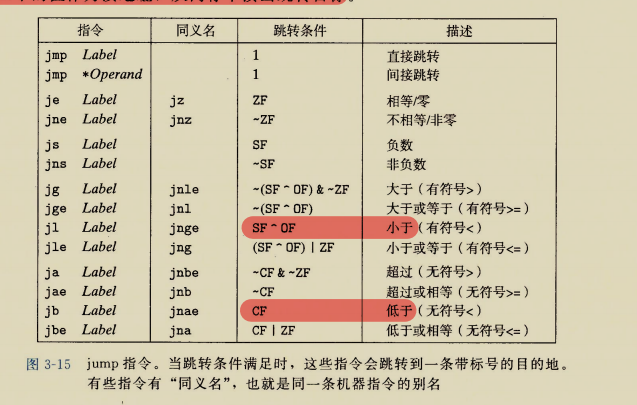

这里要注意的**间接跳转**，写法就是*后面跟一个操作数指示符

举个例子：

```
jmp *%rax   //用寄存器%rax的值作为跳转目标
jmp  *(%rax)   //用%rax中的值作为读地址，从内存中读出跳转目标
```

### 跳转指令的编码

> 在汇编代码中，我们是使用符号标号书写跳转目标的。汇编器和链接器会给跳转目标进行适当编码。

> 最常用的是**PC相对的**：他们会将目标指令的地址与紧跟在跳转指令后面的那条指令的地址之间的差作为编码。这些地址偏移量可以编码为**1、2或4个字节**

> 第二种方法是给出“绝对”地址，用4个字节直接指定目标。

下面是个例子:

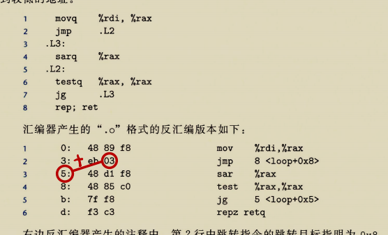

第二行中的03+下面一行的地址05就是目标地址08，

同样这里由于是一个字节的编码，第五行的f8+第六行的地址d就是目标地址05，

## 条件分支

这一部分很简单

>判断条件后跳转即可，书本例子如下

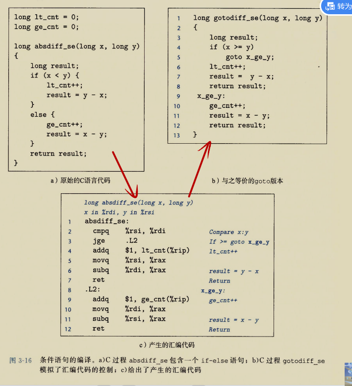

跳转和C语言中的`goto`十分相似

>**通用模版:**
>
>```c
>if(test-expr)
>then-statement
>else
>else-statement
>```
>
>
>
>汇编实现通常会使用下面这种形式，我们用C语法来描述控制流
>
>```c
>t=test-expr;
>if(!t)
>    goto false
>then-statement
> 	goto done;
>false:
>	else-state-ment
>done:
>```
>
>

## 用条件传送来实现条件分支

>**为什么要设计条件传送来实现条件分支？**
>
>条件传送（**conditional move**）是一种优化方案，用于替代传统的条件跳转（branching）。在现代处理器中，传统的条件跳转可能导致处理器性能下降，尤其是在**分支预测失败**的情况下。以下是详细的原因和条件传送的优势：
>
>### 1. **传统条件跳转的低效性**
>在传统的条件跳转中，处理器根据条件的真假来决定跳转到哪个代码分支。这种方式存在几个潜在的性能问题：
>
>- **分支预测的代价**：现代处理器使用分支预测来提前执行指令，预测是否会发生跳转。如果预测错误，处理器必须**丢弃错误路径上执行的指令**，重新从正确的路径执行，这个过程会浪费大量的时钟周期。
>  
>- **流水线的停顿**：如果处理器不能很好地预测跳转，会导致流水线暂停，等待条件判断的结果。这种停顿会影响指令的执行速度，导致处理器无法充分利用其计算能力。
>
>- 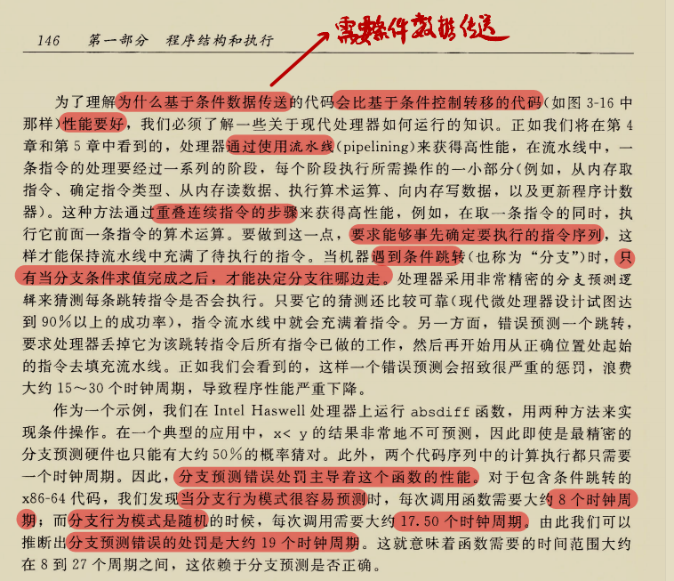
>
>### 2. **条件传送的引入**
>为了解决条件跳转带来的低效问题，条件传送指令（如 `cmov` 在 x86-64 中）被引入。这种指令在特定条件成立时才传送数据，而不依赖跳转操作。它的主要优势包括：
>
>- **消除分支预测**：条件传送通过执行传送操作而非跳转，可以避免处理器对条件跳转的预测问题，从而减少因预测错误带来的性能损失。
>  
>- **减少流水线停顿**：条件传送不会引入跳转，因此处理器可以继续顺序执行，不会因条件判断导致流水线停顿。
>
>### 3. **条件传送的工作原理**
>条件传送指令的执行依赖于处理器的**条件码寄存器**（Condition Code Register）。根据某些条件码（如零标志、符号标志等），指令判断是否执行数据传送。例如：
>
>```assembly
>cmovz %rax, %rbx   ; 如果条件码 ZF 为 1，则将 %rax 的值传送到 %rbx
>```
>
>在这条指令中，如果**零标志（ZF）**为 1，那么 `%rax` 的值会被传送到 `%rbx`，否则 `%rbx` 保持不变。
>
>### 4. **条件传送的优势**
>- **提高指令执行效率**：通过消除分支预测失败的代价，条件传送能够显著提高程序执行效率，尤其是在预测失败率较高的情况下。
>  
>- **减少分支数**：使用条件传送可以减少代码中的分支数，简化控制流，从而减少处理器在处理复杂分支时的负担。
>
>### 5. **条件传送的局限**
>尽管条件传送可以提高性能，但它并不适用于所有场景。主要局限包括：
>- **复杂条件下依然需要跳转**：对于一些复杂的控制流，条件传送无法替代分支跳转。
>- **传送的数据量限制**：条件传送只能用于处理数据传送，而不能处理更复杂的逻辑。
>
>### 总结
>条件传送的引入主要是为了减少条件跳转带来的性能损失。通过避免分支预测失败和流水线停顿，条件传送能够提高现代处理器的效率，在一定程度上优化了条件分支控制的执行速度。


这有一个例子


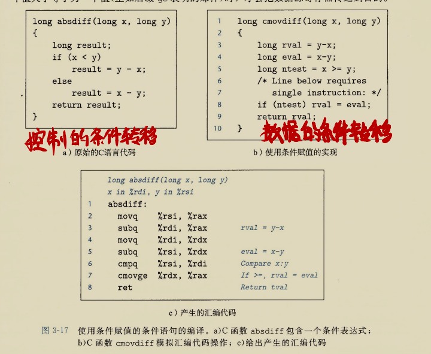


CMOVE指令类：

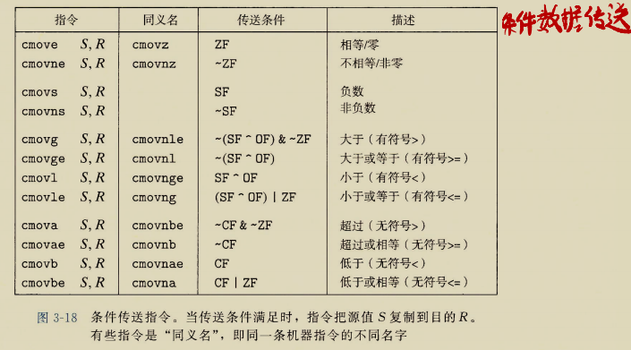

**注意：** *汇编器可以从目标寄存器的名字推断出条件传送指令的操作数长度，所以对所有操作数长度，都可以使用同一个的指令名字*

- 条件传送同条件跳转不同，处理器不需要预测测试的结果就可以执行条件传送。处理器指示读源值，检查条件码，然后要么更新目的寄存器，要么保持不变。

>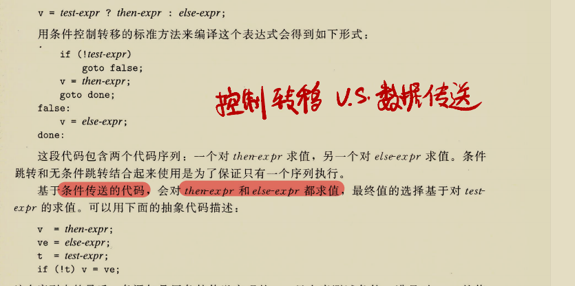
>
>**但是，所有的条件控制都可以转为条件传送吗？**
>
>考虑这个：
>
>```c
>long cread(long *xp){
>    return (xp?*xp:0)
>}
>```
>
>如果我们写出条件传送的汇编代码时
>
>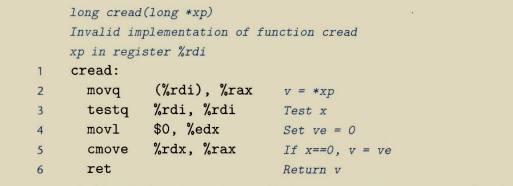
>
>很明显，当xp是一个空指针呢，第一条指令就出现引用空指针的错误
>
>所以，这种情况下，只能依靠分支代码来编译这段代码
>
>

当然，条件传送也不一定是高效的

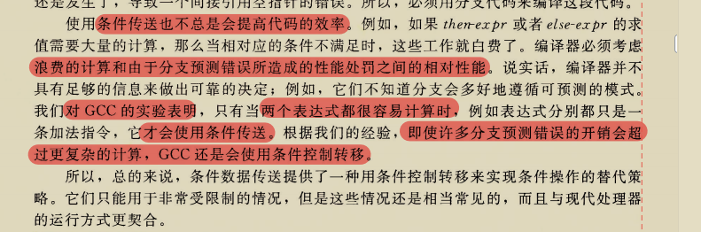


# 循环

## do-while循环

```c
do
    body-statement
    while (test-expr)
```

可以翻译成如下的goto语句

```
loop:
	body-statement
	t=test-expr;
	if(t)
		goto loop;
```

例子：

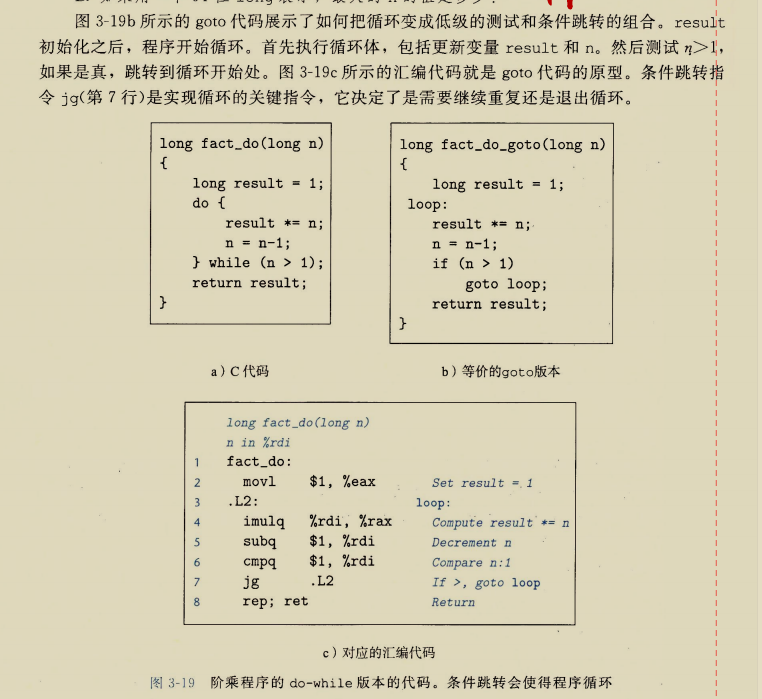

**注意：** 这个汇编代码中的rep只是相当于一个占位符，没有任何作用(虽然其在汇编中的意思是重复执行的意思，但其后面啥都没有)，放在这里是因为在跳转指令后面不能跟ret（这是汇编的一个特性（bug?））

## while循环

```c
while(test-expr)
    body-statement
```

- 第一种翻译方法:`jump to middle`

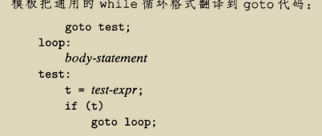

例子：

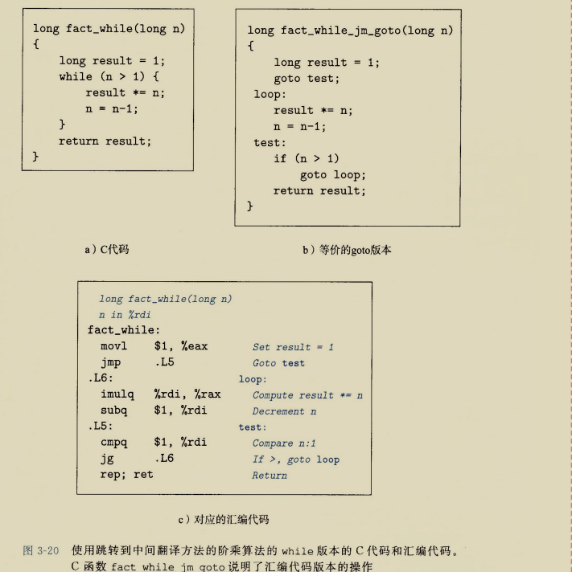

- 第二种翻译方法：`guarded-do`,即首先用条件分支，如果初始条件不成立就跳过循环，把代码转换为`do-while`循环

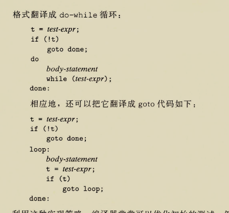

阶乘例子：

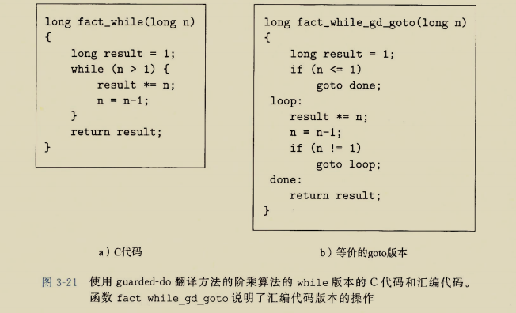

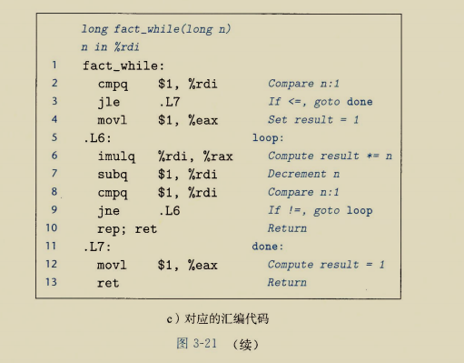

## for循环

```c
for(init-expr;test-expr;update-expr)
    body-statement
```

转化为(**有一个例外，后边提**)

```
init-expr
while(test-expr){
	body-statement
	update-expr;
}
```


例子：

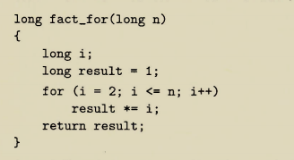

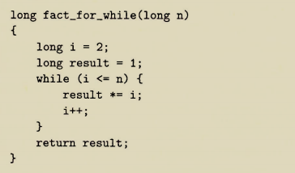

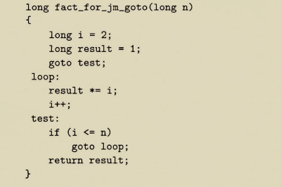

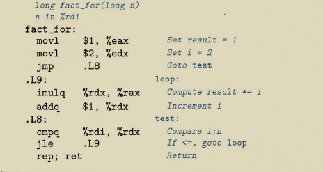

这里采用的`jump to middle`的办法

**这是那个例外**

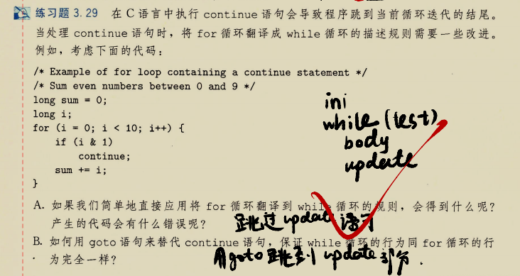

# switch语句

在简单情况下，我们使用*跳转表*这种结构实现

**跳转表**

- 跳转表是一个数组，表项i是一个代码段的地址，这个代码段实现当开关索引值等于i时程序应该采取的动作
- 执行开关语句的时间与开关情况的数量无关

例子：

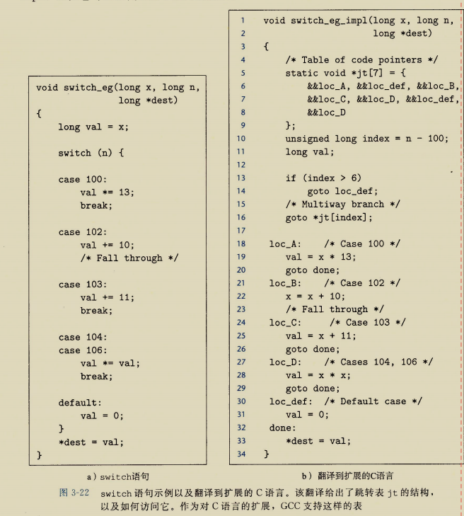

**&&前缀**：这个运算符创建一个指向代码位置的指针

对应的汇编代码：

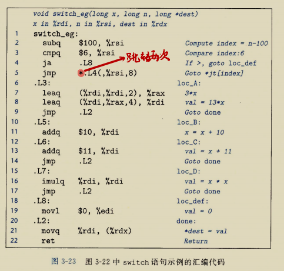

>
>
>*前缀表明这是一个间接跳转
>
>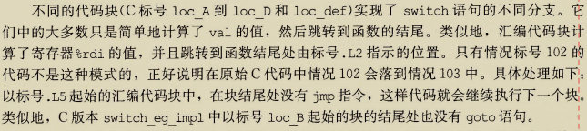

跳转表的声明：

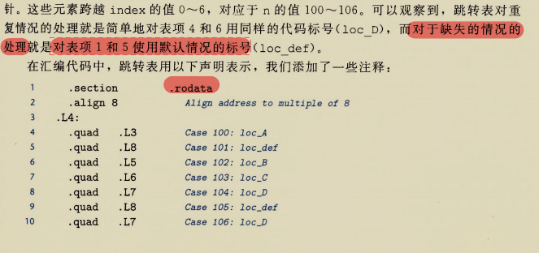

> 对于这些声明，表明在目标代码文件的段中，应该有一组7个"四"字（8个字节），每个字的值都是与指定的汇编代码标号(例如.L3)相关联的指令地址。标号.L4标记处这个分配地址的起始。与这个标号相对应的地址会作为间接跳转（汇编代码第5行）的基地址。
