过程P调用Q的机制：

- **传递控制**：在进入过程Q的时候，程序计数器必须被设置为Q的代码的起始地址，然后再返回时，要把程序计数器设置为P重调用Q后面那条程序的地址
- **传递数据**：P必须能够向Q提供一个或多个参数，Q必须能够像P返回一个值
- **分配和释放内存**：在开始时，Q可能需要为局部变量分配空间，而在返回时，需要释放这些空间

# 运行时栈

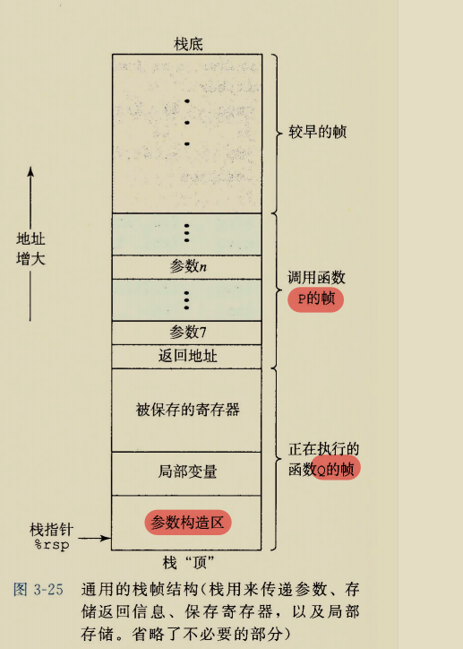

在 x86-64 中，所谓的栈，实际上一块内存区域，这个区域的数据进出满足先进后出的原则。越新入栈的数据，地址越低，所以栈顶的地址是最小的。下图中箭头所指的就是寄存器 %rsp 的值，这个寄存器是栈指针，用来记录栈顶的位置。

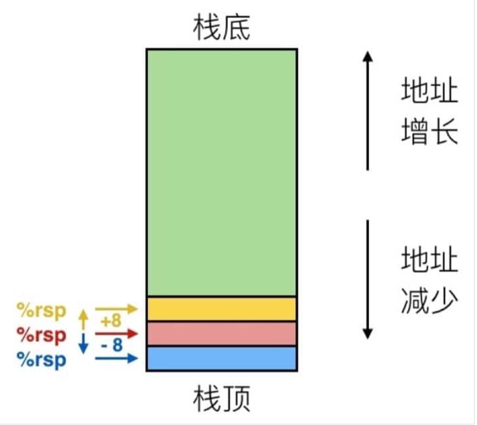

我们假设一开始 %rsp 为红色，对于 `push` 操作，对应的是 `pushq Src` 指令，具体会完成下面三个步骤：

1. 从地址 `Src` 中取出操作数
2. 把 %rsp 中的地址减去 8（也就是到下一个位置）
3. 把操作数写入到 %rsp 的新地址中

这个时候 %rsp 就对应蓝色。

重来一次，假设一开始 %rsp 为红色，对于 `pop` 操作，对应的是 `popq Dest` 指令，具体会完成下面三个步骤：

1. 从 %rsp 中存储的地址中读入数据
2. 把 %rsp 中的地址增加 8（回到上一个位置）
3. 把刚才取出来的值放到 `Dest` 中（这里必须是一个寄存器）

这时候 %rsp 就对应黄色。

# 转移控制

### call指令

**call**指令有一个目标，是指向被调用过程的起始指令地址。比如call Q,这个指令首先会将地址A（**返回地址**，是紧跟在call后面的那条指令的地址）压入栈中，并将PC设置为Q的起始地址。

两种调用方式:

- 直接调用：即**call Label**,labe是一个标号，表示跳转到标号的位置
- 间接调用: 目标是*后面跟一个操作数指示符

一个例子

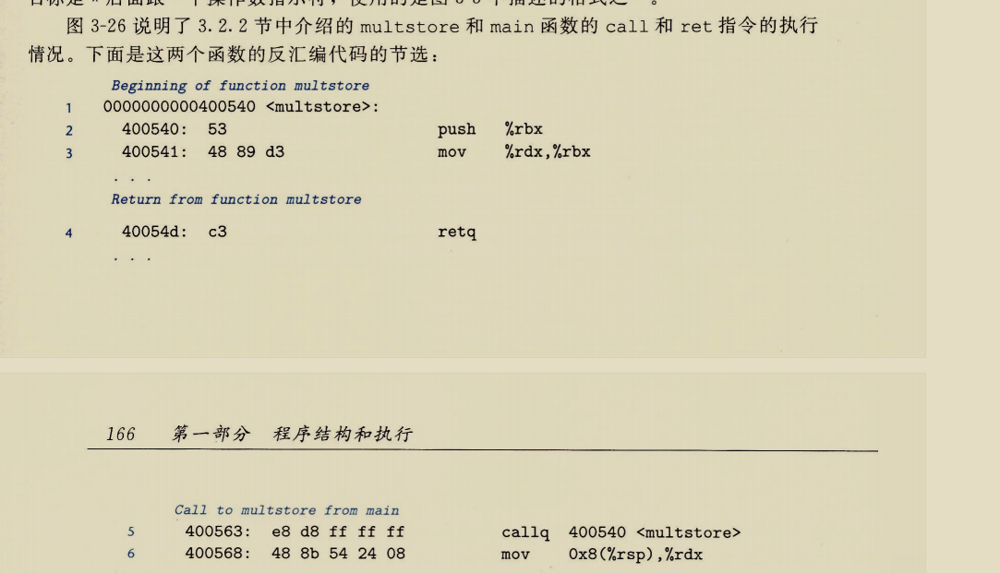

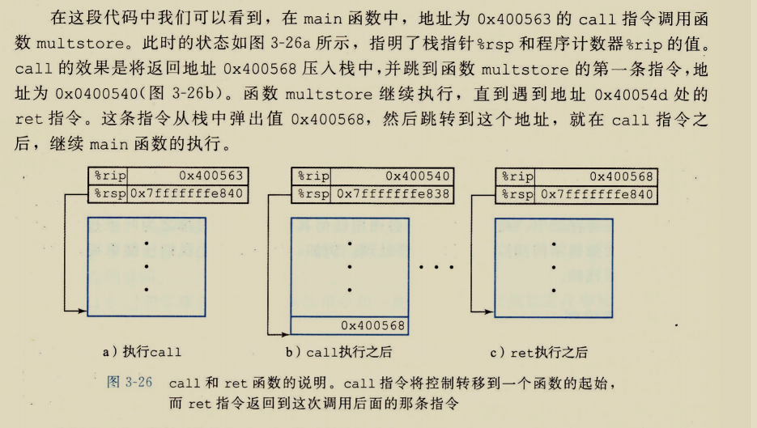

看一个更具体的实现：

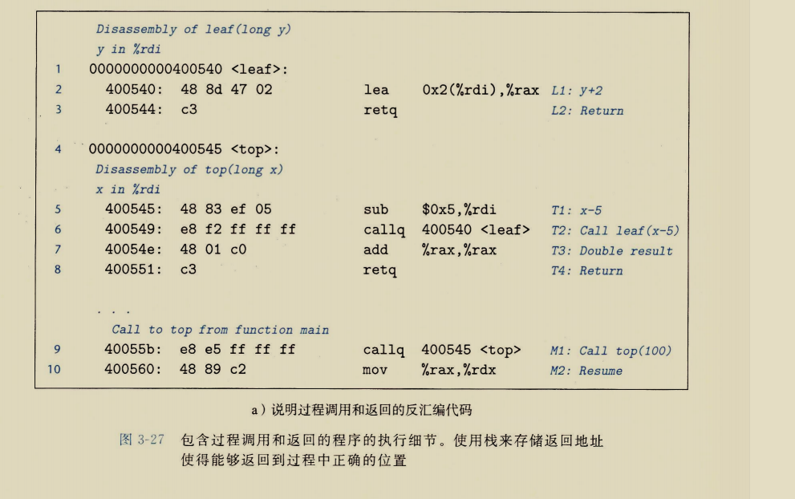

**程序实现：**

- 主函数调用`callq 400545<top>`,这个指令跳转到400545位置（即top函数的起始位置），注意，x本来就存在于%rdi中，这里实际是调用top(100)，因为%rdi就是存的第一个参数，另外这条指令把400560(也就是main中下一行地址)压入栈中
- 执行`sub $0x5,%rdi`,让x=x-5
- `callq 400540<leaf>`,跳转到leaf函数起始位置，这里调用是leaf(x)，注意是减去5的x，同时将40054e压入栈中
- `lea 0x2(%rdi),%rax`,给返回值赋值为2+y，97
- `retq`,这一步弹出栈顶的地址40054e
- `add %rax,%rax`,将返回值变成原来两倍,194
- `retq`,返回到400560
- `mov %rax,%rdx`，将返回值赋给%rdx

**注意**：*pop和push应该是成对存在的，否则内存访问会出现问题*

书上解释如下

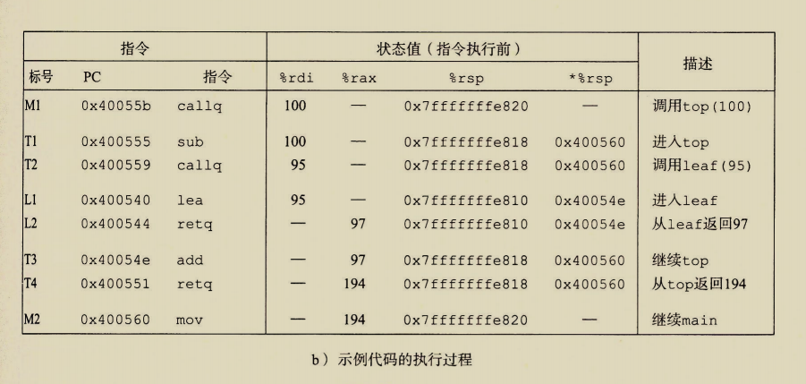

# 数据传送

我们已经看到了函数调用过程中会使用到%rdi和%rsi来传递参数，在x86-64机器中，我们可以传递参数的寄存器一共有6个，再多就要存储到内存的栈上了。

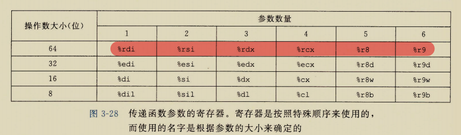

当n>6时就要回到我们原来那个图片了

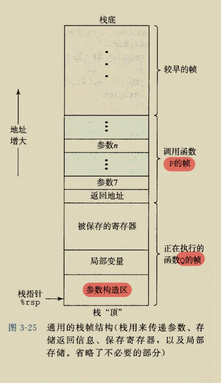

当P调用Q时，需要用到第七个或更高的参数时，就通过这个栈访问（**这个不是在栈顶访问，比如%rsp+8访问的就是第七个参数**）

看个例子

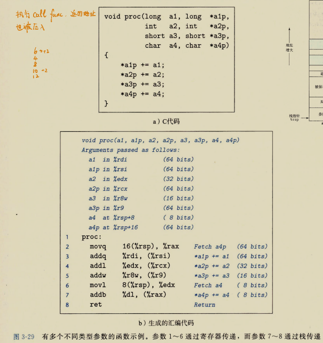

这个就是前6个参数通过寄存器，后面两个通过栈传递的例子

*注意第6行movl指令从内存读入4个字节，而后面的addb指令只使用其中的低位*

# 栈上的局部存储

我们知道函数有时候需要局部变量，这时就需要往栈中写入局部变量，分配的方式是：过程通过减小栈指针在栈上分配空间。分配的空间作为栈帧的一部分。

**我们来研究下面这部分代码**

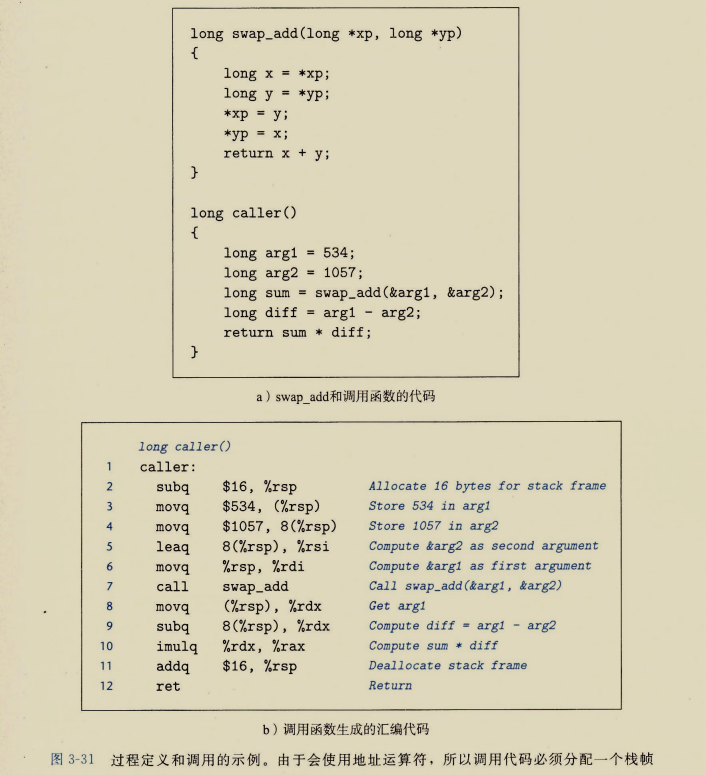

- `subq $16,%rsp`，栈指针减16，分配出来16个字节，存储arg1和arg2
- 第三行和第四行是将arg1和arg2移动到刚刚分配的内存上
- `leaq 8(%rsp),%rsi` 将%rsp+8赋值%rsi，这是将arg2的地址传递到第二个参数，第六行同理
- `call swap_add`将下一行的地址压入栈，并跳转到swap_add的起始位置
- 接下来就是接下来的操作了（应该能看懂吧）

这个例子也挺有趣的：

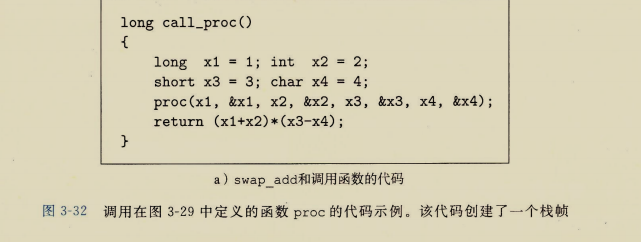

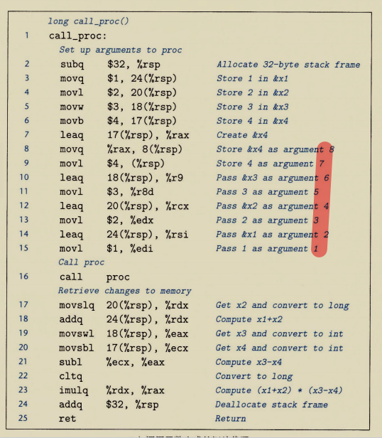

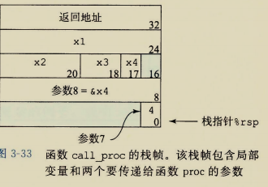

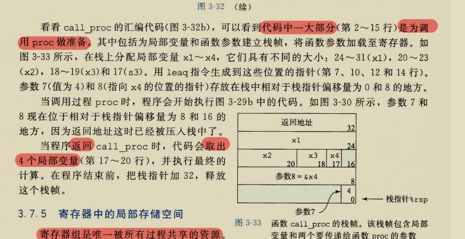

# 寄存器中的局部存储空间

- **寄存器是唯一被所有过程共享的资源**
- 要确保一个过程调用另一个过程时，被调用者不会覆盖调用者稍后会使用的寄存器值

*被调用者保存寄存器(**callee-saved**)*:

- 包括寄存器%rbx,%rbp和%r12~%r15
- 过程P调用过程Q时，如果过程Q要使用这些寄存器，应当首先把这些寄存器的值压入栈中，再使用，在返回之前回复这些寄存器的值

*调用者保存寄存器(**caller-saved**)*：

- 除了被调用者保存寄存器和栈指针%rsp之外的寄存器
- 过程P调用过程Q之前会把这些寄存器的值存入内存，然后再调用Q，这样Q就可以肆无忌惮地修改这些寄存器了

看这个例子：

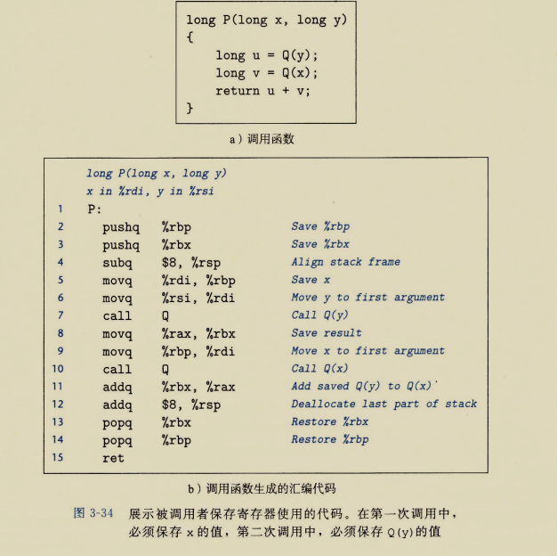

# 递归过程

​	在了解了前面的规则后，递归就很容易理解了，虽然调用的是同一个函数，但其参数不同，局部变量也会随着栈的进出合理地得到分配。

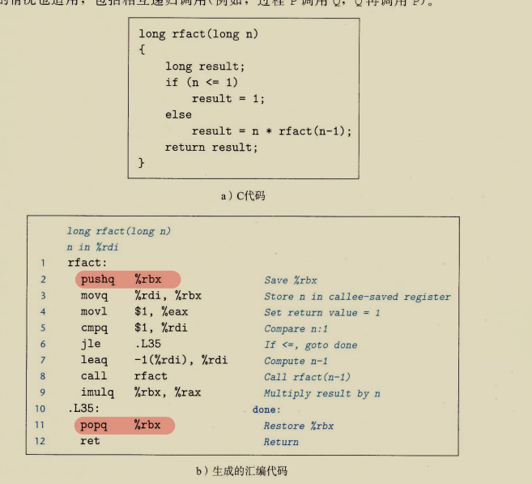
