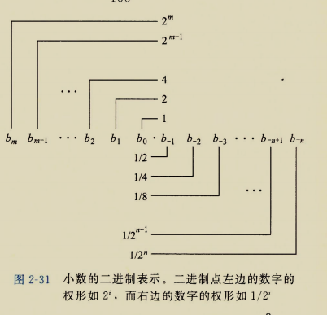
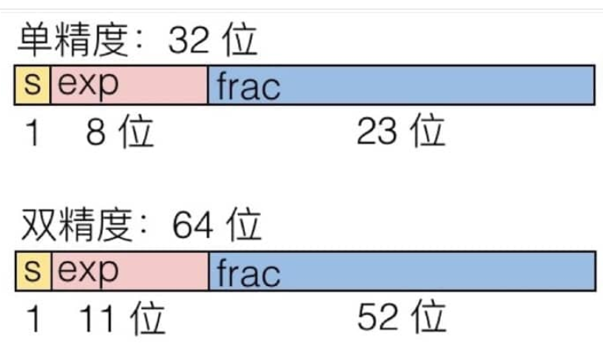
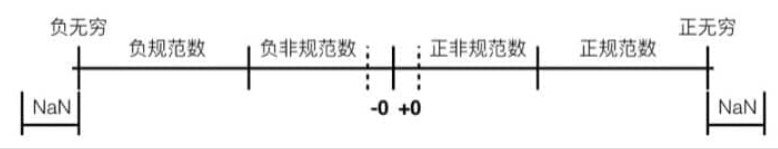
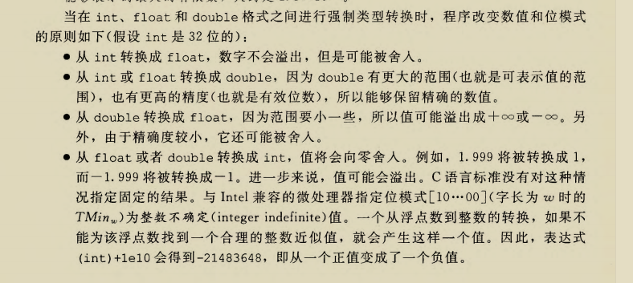

# 浮点数

## 二进制小数

简而言之，就是原来的整数多了个小数点。



浮点数可以这样表示：
$$
\sum_{k=-j}^{i}b_{k}\times\ 2^{k}
$$
例如：
$$
5\frac{3}{4}=101.11_{2},2\frac{7}{8}=10.111_{2},1\frac{7}{16}=1.0111_{2}
$$
这样的好处是，除以二就相当于右移，并且可以横跨小数点。

但是这种表示方式有明显的限制，比如说，只有形如
$$
\frac{x}{2^{k}}
$$
可以被精确表示，其他的就只能变成循环的小数，例如
$$
\frac{1}{3}=0.0101010101[01]..._{2}
$$
除此之外，另一个问题在于，如果给定了 w 个比特，能够表达的数字其实是有限的.

## IEEE浮点数

>
>
>IEEE 的浮点数标准更多是从数值角度来建立的，对于舍入，上溢出和下溢出都有比较统一的处理方法。但与此同时也给硬件优化带来了比较大的困难。因为和平时使用的数制也有一定差异，从理解的角度来看不够直观，但是好在主流的 CPU 都支持浮点数，所以我们不必过多涉及这方面的细节。

`IEEE`浮点标准用以下形式表示一个数：
$$
(-1)^{s}\times M\times 2^{E}
$$
注意：

- 符号:s决定这数是负数（s=1）还是正数(s=0)
- 尾数:M是一个二进制小数，它的范围是[1,2),[0,1)
- 阶码：E对的作用是对浮点数加权，这个权重是2的E次幂。


那么，我们可以把一个浮点数表示为三个字段



其中呢`s`即代表是符号位

`exp`是编码后的`E`

`frac`是编码后的`M`

我们根据exp的不同分为三种情况

### 规格化值（**Normalized Values**）

条件：exp的位模式记不全0（数值0），也不全1（单精度为255，双精度为2047）时。

再来回顾一下我们计算浮点数的公式：
$$
(-1)^{s}\times M\times 2^{E}
$$
这种情况下，阶段字段被解释以`偏置`的形式表示的有符号整数。

关系是`E=exp-Bias`

- Exp: 是 exp 编码区域的无符号数值

- Bias：值为
  $$
  2^{k-1}-1
  $$
  

  的偏移量，其中 k 是 exp 编码的位数，也就是说

  - 单精度：127（Exp: 1…254, E: -126…127）
  - 双精度：1023（Exp: 1…2046, E: -1022…1023）

  >**问题：为什么不采用补码形式表示 exp，而是要用一个偏置（Bias）？**
  >
  >采用偏置（Bias）表示指数部分的主要原因有以下几点：
  >
  >1. **简化比较操作**：
  >   - 使用偏置表示后，浮点数的二进制表示可以直接用于比较大小。由于偏置后的指数值都是非负的，浮点数的整体二进制表示与其数值大小呈递增关系，这使得硬件在比较两个浮点数大小时，只需按位比较即可。
  >   - 如果使用补码表示，负指数会导致最高位为 1，正指数最高位为 0，无法直接按位比较大小，增加了硬件设计的复杂性。
  >
  >2. **简化运算电路**：
  >   - 浮点数运算中，指数部分需要经常进行加减操作。采用偏置表示，指数加减运算可以直接进行，无需考虑符号位的处理。
  >   - 使用补码表示时，涉及符号位的处理，硬件需要额外的逻辑来处理正负数的运算，增加了电路的复杂性和延迟。
  >
  >3. **避免负数处理的复杂性**：
  >   - 在硬件层面，处理无符号数比处理有符号数更为简单高效。采用偏置表示，可以将指数视为无符号数处理，避免了负数运算的复杂性。
  >
  >4. **兼容非规格化数和特殊值表示**：
  >   - 浮点数表示中，指数全为 0 或全为 1 用于表示非规格化数和特殊值（如无穷大、NaN）。使用偏置表示，可以更方便地定义这些特殊情况的编码。
  >

这样我们就解决了E的编码问题

- 对于`s`:正数为0，负数为1
- 对于`M`:我们观察到，对于规格化数，整数部分一直是1，所以当把M编码成`frac`字段时，我们可以忽略整数部分，用`frac`字段只表示`M`的小数部分。

我们举个例子：

>```cpp
>float F=15213.0;
>```
>
>
>
>那么：
>$$
>15213_{10}=11101101101101_{2}=(-1)^{0}\times 1.1101101101101_{2}\times 2^{13}
>$$
>
>- s=0
>- exp=13+127=140
>- M=11011011011010000000000
>
>那么15213的浮点数表示为
>
>```
>0 10001100 11011011011010000000000
>s   exp             frac
>```

### 非规范化值（**Denormalized Values**）

条件：exp=000...0

值是非规范化的，意思是，虽然实数轴上原来连续的值会被规范到有限的定值上，但是并些定值之间的间距也是一样的。

继续看这个式子
$$
(-1)^{s}\times M\times 2^{E}
$$
和之前不同的是：
$$
E=1-Bias
$$
为啥不同嘞

>
>
>在非规范化值（Denormalized Values）的情况下，指数部分全为零，表达式中的指数 \(E\) 不再是像规范化值那样的 \(E = exp - Bias\)，而是采用了特殊的情况：
>
>### 原因：
>1. **表示最小的数值**：
>   - 规范化的浮点数有最小的有效数值范围，但如果指数部分用尽仍然需要表示更小的数，便引入了非规范化值。此时不再遵循常规的指数偏移量（Bias），因为指数已经达到了最小的可能值，所以通过降低指数权重来表示更小的数。
>
>2. **保持数值的连续性**：
>   - 规范化数和非规范化数之间的转换允许浮点数能够表示非常小的数值，从而在接近 0 的地方保持数值的连续性。
>   - 如果没有非规范化数，规范化数所能表示的最小数值与 0 之间会有很大的空白区域。为了避免这种“空洞”，非规范化值提供了更细致的分辨率，使得浮点数可以表示比最小规范化数更小的数值。
>
>3. **特殊指数处理**：
>   - 当指数部分全为 0（即 exp = 000...0）时，浮点数不再使用偏移量来计算指数 \(E\)。为了保持连贯，设定 \(E = 1 - Bias\)，而不是常规的 \(E = exp - Bias\)，确保从规范化数过渡到非规范化数时，数值的表示是平滑的。
>
>### 非规范化数的表达：
>在这种情况下：
>- 指数 \(E = 1 - Bias\) 保证浮点数可以表示比最小规范化数还要小的数。
>- 尾数 \(M\) 依然遵循通常的浮点数尾数表示规则。
>
>这样设计的目的是为了在浮点数接近 0 时，能以更高的精度表示小数，并使得小数值的间距逐渐变得更小。

非规范化数的两个用途：

- 可以表示0（exp全为0且`frac`全为0）：
  - 符号位为0时，是+0.0
  - 符号位为1时，是-0.0
- 表示接近于0的数在 exp=000..0 且 `frac≠000…0`数值是接近 0 的，并且间距是一致的

### 特殊值

条件：`exp`全为1

#### 无穷

当`exp`全为1，`frac`全为0时，表示
$$
\infty 
$$
当s=0时，表示
$$
+\infty
$$
当s=1时，表示
$$
-\infty
$$

#### `NaN`

当`exp`全为1，`frac`不全为0时，我们不认为是一个数值（Not-a-Number,NaN）,用来表示诸如
$$
\sqrt{-1},\infty-\infty
$$
等无法确定的值

## 数字实例

原理不够清晰，来看看例子咯

数轴表示：




接下来，我们以采用 1 位符号位，4 位 exp 位，3 位 frac 位，描述一下三类数字：、


```
    s exp  frac   E   值
------------------------------------------------------------------
    0 0000 000   -6   0   # 这部分是非规范化数值，下一部分是规范化值
    0 0000 001   -6   1/8 * 1/64 = 1/512 # 能表示的最接近零的值
    0 0000 010   -6   2/8 * 1/64 = 2/512 
    ...
    0 0000 110   -6   6/8 * 1/64 = 6/512
    0 0000 111   -6   7/8 * 1/64 = 7/512 # 能表示的最大非规范化值
------------------------------------------------------------------
    0 0001 000   -6   8/8 * 1/64 = 8/512 # 能表示的最小规范化值
    0 0001 001   -6   9/8 * 1/64 = 9/512
    ...
    0 0110 110   -1   14/8 * 1/2 = 14/16
    0 0110 111   -1   15/8 * 1/2 = 15/16 # 最接近且小于 1 的值
    0 0111 000    0   8/8 * 1 = 1
    0 0111 001    0   9/8 * 1 = 9/8      # 最接近且大于 1 的值
    0 0111 010    0   10/8 * 1 = 10/8
    ...
    0 1110 110    7   14/8 * 128 = 224
    0 1110 111    7   15/8 * 128 = 240   # 能表示的最大规范化值
------------------------------------------------------------------
    0 1111 000   n/a  无穷               # 特殊值
```

我们可以观察到以下几个规律：

- 最大非规格化值7/512与最小规格化数8/512之间是平滑转变。

>现在来思考：如果我们非规格化的数没有特殊处理即E=-Bias，会怎样呢？
>
>那么
>
>```
>  s exp  frac   E   值
>------------------------------------------------------------------
>  0 0000 001   -7   15/8 * 1/128 = 15/1024 	
>```
>
>
>
>这就是最最接近于0的数啦，我们发现，从14/1024到0这部分的值留下了很大的空白
>
>这就是我们特殊处理非规格数的原因！

- 最大的规格化数是240，超出这个数就会变成无穷
- 还有一个有趣的属性，这里的值的位表达式解释为无符号整数，它们是按升序排列的，就像它们表示的浮点数一样。这不是偶然的——IEEE格式如此设计就是为了浮点数能够使用证书排序函数来进行排序。

## 舍入

为啥需要舍入，IEEE标准限制了浮点数的范围和精度，所以浮点运算只能近似表示实数运算。

对于浮点数的加法和乘法来说，我们可以先计算出准确值，然后转换到合适的精度。在这个过程中，既可能会溢出，也可能需要舍入来满足 `frac` 的精度。

我们采用怎样的舍入方式呢：

`向偶数舍进`：即如果出现在中间的情况，舍入之后最右边的值要是偶数。

- 十进制例子：

| 原数值    | 舍入结果 |
| --------- | -------- |
| 2.8949999 | 2.89     |
| 2.8950001 | 2.90     |
| 2.8950000 | 2.90     |

- 二进制例子：

| 原数值   | 舍入结果 |
| -------- | -------- |
| 10.00011 | 10.00    |
| 10.00110 | 10.01    |
| 10.11100 | 11.00    |
| 10.10100 | 10.10    |

## 浮点运算

### 浮点数乘法

$$
(-1)^{s_1}M_{1}2^{E_{1}}\times (-1)^{s_{2}}M_{2}2^{E_{2}}
$$

结果是
$$
(-1)^{s}M2^{E}
$$
其中:s=s_1^s_2
$$
 M=M_{1}\times M_{2},E=E_{1}+E_{2}
$$
`注意`：

- 如果 M 大于等于 2，那么把 M 右移，并增加 E 的值。
- 如果 E 超出了可以表示的范围，溢出
- 把 M 舍入到 frac 的精度

- 相乘可能产生 infinity 或者 NaN
- 满足交换率
- 不满足结合律（因为舍入会造成精度损失）
- 乘以 1 等于原来的数
- 不满足分配率 `1e20*(1e20-1e20)=0.0` 但 `1e20*1e20-1e20*1e20=NaN`
- 除了 infinity 和 NaN，满足单调性，即 a≥b→a×c≥a×b

### 浮点数加法

$$
(-1)^{s_1}M_{1}2^{E_{1}}+ (-1)^{s_{2}}M_{2}2^{E_{2}}
$$

这里假设 E1>E2,结果是
$$
(-1)^{s}M2^{E}
$$
则
$$
s=s_{1},M=尾数调整后的和,E=E_{1}
$$

#### 浮点数加法的正确过程：

1. **对齐指数**：如果两个浮点数的指数不同，那么我们需要通过右移尾数较小的数来对齐它们的指数，使得 \(E_1 = E_2\)。这一步决定了哪些部分被舍入或者丢弃。
   - 假设 \(E_1 > E_2\)，那么我们需要将 \(M_2\) 右移 \(E_1 - E_2\) 位来对齐指数。
   
2. **比较尾数并决定符号**：此时才可以比较尾数。我们根据对齐后的尾数比较来决定结果的符号 \(s\)，以及进行尾数的加减操作。如果 \(M_1\) 比 \(M_2\) 大，那么结果的符号与 \(s_1\) 相同，否则符号与 \(s_2\) 相同。

3. **尾数相加或相减**：根据两个数的符号，如果符号相同，就直接相加尾数；如果符号不同，就进行尾数的减法。

4. **规范化与舍入**：相加或相减后的结果可能需要再次进行标准化处理，例如如果尾数超过 1 或者小于 1，则需要调整尾数和指数。另外，也需要对结果进行舍入，以确保精度。

5. **溢出处理**：如果最后的指数超出了浮点数能表示的范围，会产生正无穷大或负无穷大。

#### 重要的是：

**指数的对齐** 是浮点数加法的核心步骤，因为它影响到尾数的比较和计算结果的精度。

#### 基本性质：

- **相加可能产生 infinity 或 NaN**。
- **满足交换率**：a+b=b+a
- **不满足结合律**：舍入误差使得

$$
(a+b)+c\neq a+(b+c)
$$


- **加 0 不改变结果**：a+0=a
- **不满足分配律**

$$
：a×(b+c)≠a×b+a×c在浮点数中不成立。
$$


#### 单调性：

除了无穷大和 NaN，浮点数加法满足单调性，即
$$
如果 a≥b那么 a+c≥b+c
$$

### C语言中的浮点数


