># 前言
>
>## 处理器架构
>
>**处理器架构**（Processor Architecture）是指计算机处理器内部的设计框架或蓝图，它定义了处理器如何执行指令、管理数据、通信等一系列操作。处理器架构是计算机硬件和软件之间的桥梁，决定了处理器如何与操作系统、编译器以及程序交互。
>
>### 关键组成部分：
>1. **指令集架构（ISA）**：
>   - 指令集架构是处理器架构的核心部分，定义了处理器可以理解和执行的基本指令。例如，`x86` 和 `ARM` 是两种常见的指令集架构。
>   - 它包括指令的操作码（操作类型）和操作数（需要处理的数据）。ISA 还定义了寄存器的数量和大小、内存访问模式以及数据类型等内容。
>
>2. **寄存器和内存模型**：
>   - 不同的处理器架构定义了不同的寄存器数量和大小。寄存器是处理器内部用于快速存储和处理数据的高速存储器。
>   - 内存模型决定了处理器如何与内存通信，例如是采用分段式、分页式内存管理等。
>
>3. **并行处理能力**：
>   - 现代处理器架构通常支持多核和多线程，允许多个任务并行处理。架构设计决定了处理器如何调度这些任务和共享资源。
>
>4. **扩展和特性**：
>   - 处理器架构还可以决定一些高级特性，如虚拟化支持、加密加速、浮点计算能力、低功耗设计等。
>
>### 常见处理器架构：
>1. **x86** 和 **x86-64**：
>   - 由 Intel 和 AMD 主导，主要用于台式机、笔记本电脑和服务器。
>   - `x86` 是32位架构，`x86-64` 是其64位扩展版，能够支持更大的内存空间。
>
>2. **ARM**：
>   - ARM 是一种精简指令集（RISC）架构，广泛用于移动设备、嵌入式系统以及低功耗应用。
>   - 具有高效能效比，因此被应用在智能手机、平板电脑和物联网设备中。
>
>3. **RISC-V**：
>   - RISC-V 是一种开放源代码的 RISC 架构，逐渐受到关注，因为它允许开发者和公司自由定制处理器设计。
>
>### 为什么处理器架构重要？
>处理器架构直接影响计算机系统的性能、功耗、兼容性和成本。不同架构的处理器通常专门为特定应用场景进行优化，如桌面应用、移动设备、服务器、大数据处理等。
>
>### 总结：
>处理器架构定义了计算机处理器的工作方式，包括指令执行、数据存储和通信等方面。它是硬件设计的基础，同时影响操作系统和软件如何与处理器交互。常见的处理器架构包括 x86、ARM 和 RISC-V 等。
>
>## Intel处理器的发展
>
>Intel处理器的发展历史可以追溯到1971年，标志着现代计算技术的兴起。以下是其简要发展历程：
>
>### 1. **1970s：4004与8086时代**
>   - **Intel 4004（1971年）**：世界上第一款商用微处理器，由Intel推出。这是一款4位处理器，最早用于计算器中。
>   - **Intel 8086（1978年）**：Intel的第一款16位处理器，它引领了x86架构的诞生。该架构成为Intel处理器的基础，直到今天。
>
>### 2. **1980s：80386与x86架构的兴起**
>   - **Intel 80386（1985年）**：第一款32位处理器，引入了虚拟内存支持和多任务处理功能，大大提升了计算能力。它奠定了PC市场的基础，使个人电脑逐渐普及。
>
>### 3. **1990s：奔腾系列与高速计算**
>   - **Intel Pentium（1993年）**：这标志着奔腾系列处理器的开始，它们具有强大的浮点运算能力，广泛应用于图形处理、游戏和科学计算领域。
>   - **Pentium Pro（1995年）**：引入了多级缓存和超标量架构，极大提高了并行处理能力。
>
>### 4. **2000s：多核与移动计算**
>   - **Intel Core系列（2006年）**：引入多核处理器技术，开始从单核向多核架构转变，提升了并行处理能力。Intel Core系列迅速成为消费类PC的主流处理器。
>   - **Intel Atom（2008年）**：一款低功耗处理器，专为移动设备和嵌入式设备设计，旨在优化电池续航。
>
>### 5. **2010s：超线程与集成GPU**
>   - **Intel Core i3/i5/i7系列**：这几代产品逐渐成为市场主流，集成了超线程技术与集成图形处理器（GPU），使其在性能和图形处理能力上有显著提升。
>   - **Intel Xeon系列**：用于服务器和高性能计算领域，提供了更强的并行处理和多任务处理能力。
>
>### 6. **2020s：10nm与Alder Lake架构**
>   - **10nm制程技术**：尽管面临一些生产挑战，Intel最终在2020年推出了基于10nm制程的处理器，进一步提升了功耗效率。
>   - **Alder Lake（2021年）**：采用混合架构，结合高性能核心与高能效核心，类似于ARM架构中的big.LITTLE设计，为未来的高效计算奠定了基础。
>
>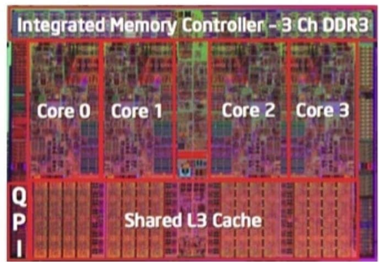
>
>### 总结
>Intel处理器在过去的50年中经历了从简单的4位计算器芯片到复杂的多核、多线程处理器的巨大转变。Intel通过创新的架构、制程和多核心设计，不断推动计算能力的发展和提升，主导了全球PC市场。
>
>## 指令集
>
>**指令集**（Instruction Set Architecture, ISA）是处理器能够执行的指令集合，它定义了计算机的硬件如何理解和执行程序。简单来说，指令集是处理器与软件之间的接口，规定了程序如何控制处理器的行为。
>
>### 指令集的主要功能：
>1. **指令的定义**：指令集规定了所有可以执行的操作，如数据传输（例如将数据从内存加载到寄存器）、算术运算、逻辑运算、控制转移（如跳转、条件分支）等。
>2. **数据类型和寄存器**：指令集定义了处理器支持的数据类型（如整数、浮点数）和寄存器的数量、大小等。
>3. **寻址模式**：指令集规定了处理器如何访问内存和寄存器中的数据，即寻址方式（例如直接寻址、间接寻址、基址+偏移等）。
>4. **存储管理**：一些指令集还包括内存管理、缓存和输入输出管理等机制。
>
>### 常见的指令集架构：
>1. **x86**：由 Intel 和 AMD 使用，是 CISC（复杂指令集）架构的典型代表，应用于大多数个人电脑和服务器。
>2. **ARM**：广泛应用于移动设备和嵌入式系统，属于 RISC（精简指令集）架构。
>3. **RISC-V**：开源的 RISC 指令集，越来越受到关注，允许开发者自由定制处理器。
>
>### 总结：
>指令集是处理器理解和执行软件的规则和规范。它决定了硬件能执行哪些操作、支持的数据类型、内存访问方式等。不同的处理器架构拥有不同的指令集，这影响了软件的设计与优化方式。

---

`导航------------------------------------------------------------------------------------------>`

计算机能读懂的只有零和一，而我们用汇编去和计算机『感同身受』。接近硬件底层，很多代码中再平常不过的概念，具体实现起来则并没有看起来那么『理所当然』。

# 从C到机器代码

机器代码，说白了，就是01序列，这也是计算机能读懂的直接可执行的代码，但显然，其不适合人读。所以，把字节按照具体含义进行『翻译』，就成了人类可以阅读的汇编代码。即汇编代码是机器代码的文本表示。注意：『翻译』并不是编译。

C语言与机器代码是完全不同的逻辑。机器代码就纯粹从`执行`的角度思考，而C作为一门高级语言，其抽象级别很高。而且高级语言编写的程序是可以在很多不同的机器上编译和执行的。

>"一门新语言绝非只是一套语法规则，而是一系列配套的工具加上语法规则。C 语言代码最终成为机器可执行的程序，会像流水线上的产品一样接受各项处理"
>
>`gcc如何使C变成机器代码`
>
>- C`预处理器`通过插入所用`#include`命令指定文件，并扩展所有`#define`声明指定的宏来扩展源代码
>
>- 源代码(da.c, wang.c)经过`编译器`的处理(`gcc -0g -S`)成为汇编代码(da.s, wang.s)
>- 汇编代码(da.s, wang.s)经过`汇编器`的处理(`gcc` 或 `as`)成为对象程序(da.o, wang.o),即`目标代码文件`，目标代码是机器代码的一种形式，包含所有指令的二进制表示，但是没有填入全局值的地址。
>- 对象程序(da.o, wang.o)以及所需静态库(lib.a)经过`链接器`的处理(`gcc` 或 `ld`)最终成为计算机可执行的程序

我们来看一段C语言及其编译生成的汇编代码。

```c
// 代码文件: sum.c
long plus(long x, long y);

void sumstore(long x, long y, long *dest)
{
    long t = plus(x, y);
    *dest = t;
}
```

其对应的汇编代码是

```
sumstore:
    pushq   %rbx
    movq    %rbx, %rbx
    call    plus
    movq    %rax, (%rbx)
    popq    %rbx
    ret
```

可以看到，汇编代码有着统一的格式。在汇编代码中，第一个字符串叫做操作符，后面可能跟着1/2/3个一逗号分隔的操作数，为什么是以这样的形式呢？这就要从处理器的运算方式讲起了，先来看看处理器是如何配合内存进行计算的：

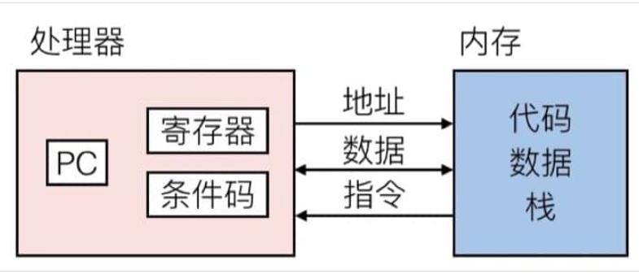

- 程序计数器（`PC,Program counter`）- 存着下一条指令的地址，在x86-64中称为RIP
- 寄存器(Register) - 用来存储数据以便操作
- 条件代码(Codition codes) - 通常保存最近的算术或逻辑操作的信息，用来做条件跳转

>这里需要注意，处理器能够执行的操作其实是非常有限的，简单来说只有三种：存取数据、计算和传输控制。存取数据是在内存和寄存器之间传输数据，进行计算则是对寄存器或者内存中的数据执行算术运算，传输控制主要指非条件跳转和条件分支。这也就是为什么汇编代码有固定的 `指令 操作数1 (,操作数2 ,操作数3)` 这样的形式了。

比较

```
// C 代码
*dest = t;

// 对应的汇编代码
movq    %rax, (%rbx)

// 对应的对象代码
0x40059e:   46 89 03
```

C 代码的意思很简单，就是把值 `t` 存储到指针 `dest` 指向的内存中。对应到汇编代码，就是把 8字节（也就是四个字, Quad words）移动到内存中（这也就是为什叫做 `movq`）。`t` 的值保存在寄存器 %rax 中，`dest` 指向的地址保存在 %rbx 中，而 `*dest` 是取地址操作，对应于在内存中找到对应的值，也就是 `M[%rbx]`，在汇编代码中用小括号表示取地址，即 `(%rbx)`。最后转换成 3 个字节的指令，并保存在 `0x40059e` 这个地址中。

# 访问信息

## 寄存器

**寄存器**是计算机中央处理器（CPU）中的一种非常小且速度极快的存储单元，专门用于存储处理过程中需要立即访问的数据。寄存器的存储容量通常较小（几位到几百位不等），但其读取和写入速度比主内存快得多，因为它们位于处理器的内部。

其包含一组16个存储64位值的**通用目的寄存器**。

>
>
>在 **x86-64 架构**的处理器中，有一组 **16个通用目的寄存器**，这些寄存器可以存储 **64位** 的值，适用于多种数据处理任务，包括算术运算、逻辑运算、内存寻址等。它们是程序运行时CPU操作的核心寄存器。
>
>### 1. **RAX**（累加寄存器，Accumulator）
>   - 用于算术运算、返回值的存储等。比如，在函数调用后，RAX 中会保存函数的返回值。
>
>### 2. **RBX**（基址寄存器，Base）
>   - 通常用于存储内存地址，也可以作为通用寄存器使用。
>
>### 3. **RCX**（计数器寄存器，Counter）
>   - 常用于循环和字符串操作。在 `rep` 指令中，RCX 用作循环计数器。
>
>### 4. **RDX**（数据寄存器，Data）
>   - 常与RAX配合，用于乘法、除法等复杂算术运算。
>
>### 5. **RSI**（源索引寄存器，Source Index）
>   - 通常在内存复制、字符串操作时，用作源地址指针。
>
>### 6. **RDI**（目的索引寄存器，Destination Index）
>   - 常与RSI配合，用于字符串操作时的目标地址指针。
>
>### 7. **RBP**（基址指针寄存器，Base Pointer）
>   - 常用于栈操作，尤其是在函数调用时保存调用栈的基地址。它可以帮助访问局部变量和参数。
>
>### 8. **RSP**（栈指针寄存器，Stack Pointer）
>   - 指向当前栈的顶部，用于函数调用、返回地址的保存及局部变量的管理。
>
>### 9. **R8 到 R15**（扩展通用寄存器）
>   - 在x86-64架构中新增的8个通用寄存器。这些寄存器提供额外的空间，进一步提升了多线程和并行计算时的效率。
>     - **R8**、**R9**、**R10**、**R11**：这些寄存器通常用于函数调用时保存参数值。
>     - **R12**、**R13**、**R14**、**R15**：作为额外的通用寄存器，灵活用于各种数据处理任务。
>
>### 使用模式
>- 这些寄存器不仅限于64位操作。根据需要，它们也可以访问寄存器的低32位、16位甚至8位。例如，`RAX` 的低32位部分可以通过 `EAX` 访问，低16位部分可以通过 `AX` 访问，最低8位部分可以通过 `AL` 访问。
>
>### 总结：
>这些16个通用寄存器是x86-64架构中进行各种操作的基础。它们支持高效的数据处理，并能大大提高程序执行的速度和效率。

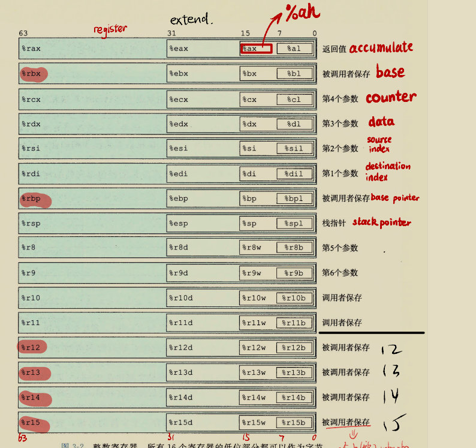

>
>
>当指令以寄存器作为目标时，对于生成小于8字节结果的指令：
>
>- 生成1字节和2字节数字的指令会保持剩下的字节不变
>- 生成4字节数字的指令会把高位4个字节置为0

前六个寄存器(%rax, %rbx, %rcx, %rdx, %rsi, %rdi)称为通用寄存器，有其『特定』的用途：

- %rax(%eax) 用于做累加
- %rcx(%ecx) 用于计数
- %rdx(%edx) 用于保存数据
- %rbx(%ebx) 用于做内存查找的基础地址
- %rsi(%esi) 用于保存源索引值
- %rdi(%edi) 用于保存目标索引值

而 %rsp(%esp) 和 %rbp(%ebp) 则是作为栈指针和基指针来使用的。

## 寻址

操作数分为三种类型：

- 立即数(`immediate`),用来表示常数值。书写:$IMM（IMM为常数值），IMM就是该地址存放的值

- 寄存器(`register`),表示某个寄存器的内容。书写：$$R[r_a]$$

- 内存引用，它会根据计算出来的地址（通常称为**有效地址**）访问某个内存地址

  我们用符号
  $$
  M_b[Addr]
  $$
  表示对存储在内存中从地址Addr开始的b个字节值的引用。为了方便，我们通常省去下标b

  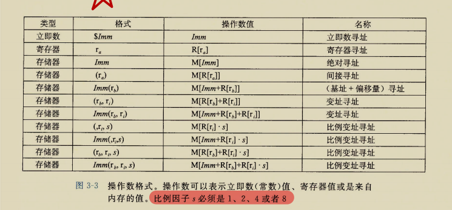

$$
Imm(r_b,r_i,s)
$$

表示的是最常用的形式，由四个组成部分：

- 立即数便宜Imm

- 基址寄存器(`必须是64位`)
  $$
  r_b
  $$

- 变址寄存器(`必须是64位`，除了**%rsp**)
  $$
  r_i
  $$

- 比例因子s(`s必须是1、2、4或者8`)

一个例子：

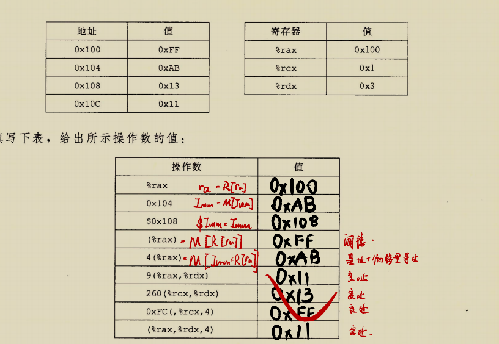

## 数据传送指令

>Intel用术语"字(word)"表示16位数据类型，因此32位数据称为“双字”，称64位数位“四字”。

MOV类：把数据从源位置复制到目的位置

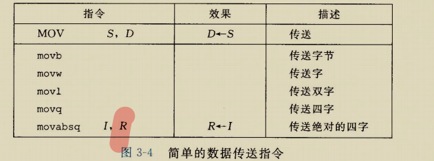

源操作数可以是立即数、寄存器值或内存值的任意一种，但目标操作数只能是寄存器值或内存值。指令的具体格式可以这样写 `movq [Imm|Reg|Mem], [Reg|Mem]`，第一个是源操作数，第二个是目标操作数，例如：

- `movq Imm, Reg` -> `mov $0x5, %rax` -> `temp = 0x5;`
- `movq Imm, Mem` -> `mov $0x5, (%rax)` -> `*p = 0x5;`
- `movq Reg, Reg` -> `mov %rax, %rdx` -> `temp2 = temp1;`
- `movq Reg, Mem` -> `mov %rax, (%rdx)` -> `*p = temp;`
- `movq Mem, Reg` -> `mov (%rax), %rdx` -> `temp = *p;`

`注意`：(%rax)与(%rbx)均表示间接寻址，参见上表

有一个限制，传送指令的两个操作数不能都指向内存位置。

因此，将一个值从一个内存位置复制到另一个内存位置需要两条指令

- 先将源值加载到寄存器中
- 将寄存器值写入目的位置

再`注意`:

- 以上这些 指令的寄存器操作数可以是16个寄存器有标号部分中的任意一个，
- 寄存器部分的大小必须与指令最后一个字符（'b','w','l'或'q'）指定的大小匹配
- 大多数情况下，MOV指令只会更新目的操作数指定的那些寄存器字节或内存位置，`但是！！！`
  - `movl指令以寄存器作为目的时，它会把该寄存器的高位4字节设置成0`

- 常规的movq指令只能以表示为32位补码数字的立即数作为操作数，然后把这个值符号扩展得到64位的值，放到目的位置
- movabsq指令能够以任意64位立即数值作为源操作数，并且只能以寄存器作为目的。

`将小的源值复制到较大的目的的数据移动指令`

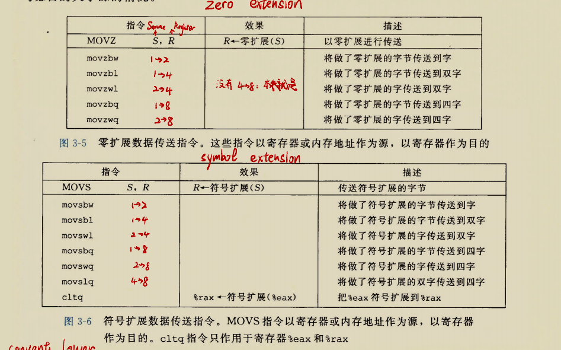

`注意`：

- 没有指令将4字节源值零扩展到8字节，因为前面提到的`movl`就天然完成这个
- `cltq`指令没有操作数，其等价于`movslq %eax,%rax`

### 数据传送实例

```c
long exchange(long *xp,long y)
{
 long x=*xp;
 *xp=y;
 return x;
}
```

对应的汇编代码是

```
exchannge:
	movq	(%rdi),%rax	//(%rdi)间接寻址找到*xp，并复制到%rax寄存器上，即复制给x
	movq	%rsi,(%rdi)	//再把%rsi上的值即x复制给(%rdi)间接寻址到的地址即*xp
	ret					//返回
```


- C语言中所谓的“指针”其实就是地址(间接引用指针就是将该指针放在一个寄存器中，然后在内存引用中使用这个寄存器)

- 像x这种局部变量通常是保存在寄存器中，而不是内存中。访问寄存器要比访问内存快的多。

  ## 压入和弹出栈数据

  栈:先进后出

  通过pop操作删除数据时，弹出的值永远是最近被压入而且仍然在栈中的值。

  栈顶:插入和删除元素的那一端。

  在x86-64架构中，程序栈存放在内存中某个区域，`栈向下增长`，因此栈顶元素时所有栈中元素地址中最低的。栈指针`%rsp`保存着栈顶元素的地址

  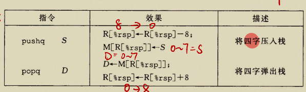

`解释`：

- 当使用`pushq	S`指令时，要先扩容，即栈顶指针`%rsq`先减8，再把S存储到`(%rsq)`中，注意括号哦，因此该指令等价于下面这两条
  - `subq	$8,%rsp`（这个是减法指令，用%rsp减去8）
  - `movq   %rbp,(%rsp)`
- 当使用`popq        D`指令时，要先传值，再减容，即先将`(%rsp)`传给目标地址D,再将栈顶指针加8.因此该指令等价于下面两条
  - `movq    (%rsp),%rax`
  - `addq     $8,%rsp`（加法操作，就是把%rsp加8）

`看个例子`

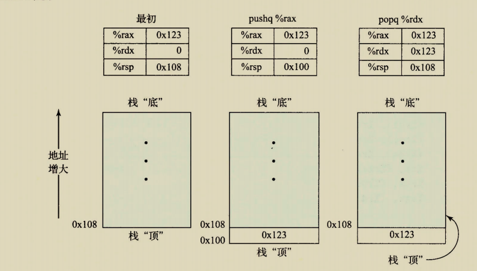

一点需要注意的就是，即使pop之后，%rsp虽然不再指向0x100位置，但是0x100位置存的0x123的值仍然在那，直到下次被覆盖。

# 算术和逻辑操作

四组操作：加载有效地址、一元操作、二元操作和移位

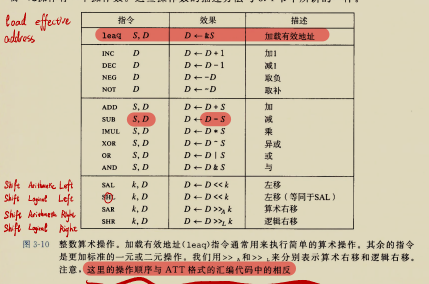

这些指令类有各种带不同大小操作数的变种(`只有leaq没有其他大小的变种`)

例如ADD由四条加法指令组成:`addb、addw、addl和addq`

## 加载有效地址

leaq指令并不会真正的访问内存，它的第一个操作数看上去是一个内存引用，但该指令并不是从指定位置读入数据，而是将有效地址写入到目的操作数。也就是说，即是讲第一个操作数存放的值写入目的操作数。

看看GPT给出的几个例子吧。

>
>
>这里有两个具体的 `leaq` 指令例子，帮助理解它在不同情况下的应用：
>
>### 示例 1：计算指针偏移
>```assembly
>leaq 8(%rbp), %rax
>```
>**解释**：
>- 这条指令计算 `rbp + 8`，并将结果存储在寄存器 `%rax` 中。
>- 它并不访问内存，只是单纯计算地址，这可以用于实现指针运算。例如，若 `%rbp` 指向一个数组的起始位置，那么此操作可以计算出该数组第 2 个元素的地址（假设每个元素占用 8 字节）。
>
>### 示例 2：代替乘法和加法
>```assembly
>leaq (%rsi,%rsi,2), %rax
>```
>**解释**：
>- 这条指令相当于计算 `rsi * 2 + rsi`，即 `rsi * 3`，并将结果存储在 `%rax` 中。
>- 通过 `leaq`，我们可以用一种非常高效的方式来执行乘法操作，而不必使用更慢的 `imul` 指令。注意，这种用法也只是计算，而不会访问内存。
>
>### 示例 3：复杂的地址计算
>```assembly
>leaq 4(%rbx,%rbx,2), %rax
>```
>**解释**：
>- 该指令计算 `rbx * 2 + rbx + 4`，即 `3 * rbx + 4`，并将结果存储在 `%rax` 中。
>- 这是一个结合了加法、乘法和偏移量的有效地址计算，通常用于数组或复杂的指针运算。
>
>### 使用场景：
>1. **指针运算**：在访问数组时，计算某个偏移位置的内存地址。
>2. **代替算术运算**：可以替代乘法和加法，用于快速计算值。
>
>通过这几个例子，`leaq` 可以高效地完成内存地址计算或算术运算，但不会进行实际的内存访问，这是它的一个重要特点。

## 一元和二元操作

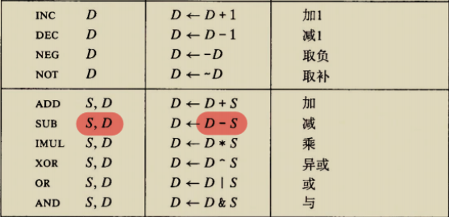

- 一元操作数顾名思义只有一个操作数，既是源也是目的，这个操作数只能是寄存器和内存。
- 二元操作数，第一个操作数三种均可，第二个只能是寄存器或是内存位置
  - `注意：`
  - 第二个操作数是内存地址时，处理器必须从内存读出值，执行操作，再把结果写回内存

## 移位操作

第一个操作数是移位量（立即数、单字节寄存器(%cl，`很特别，只允许这个特定的寄存器作为操作数`)），第二个操作数是要移位的数

注意这个

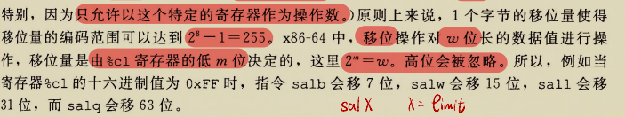

我们来看一个C转变成汇编的例子

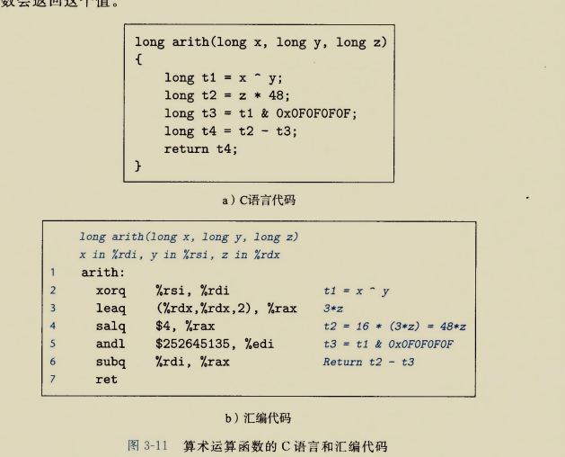

## 特殊的算术操作

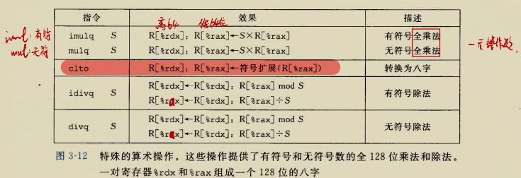

`imulq`指令有两种不同的形式

- `IMUL`指令类的一种，此时**imulq**是一个双操作数，它从两个64位操作数产生一个64位乘积
- 单操作数，来计算两个64位的全128位乘积
  - 必须要求一个参数在寄存器`%rax`内，另一个作为指令的源操作数
  - 乘积及存在`%rdx`(高64位)和`%rax`（低64位）

例子：


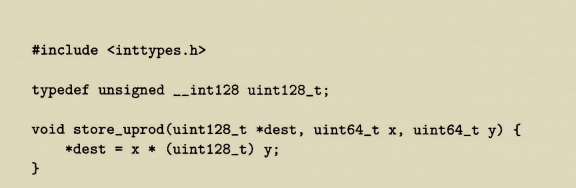

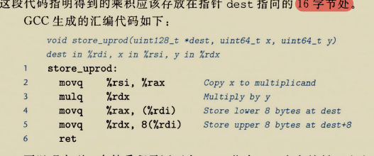

这里由于生成代码针对的是小端法机器，所以高位字节存储在大地址。

`除法和取模运算`

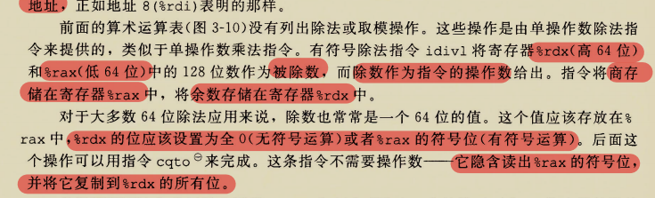

例子：

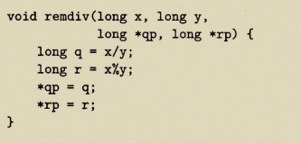

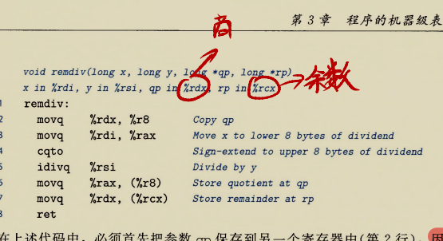

把qp保存到另一个寄存器中是因为除法操作要使用参数寄存器%rdx.
