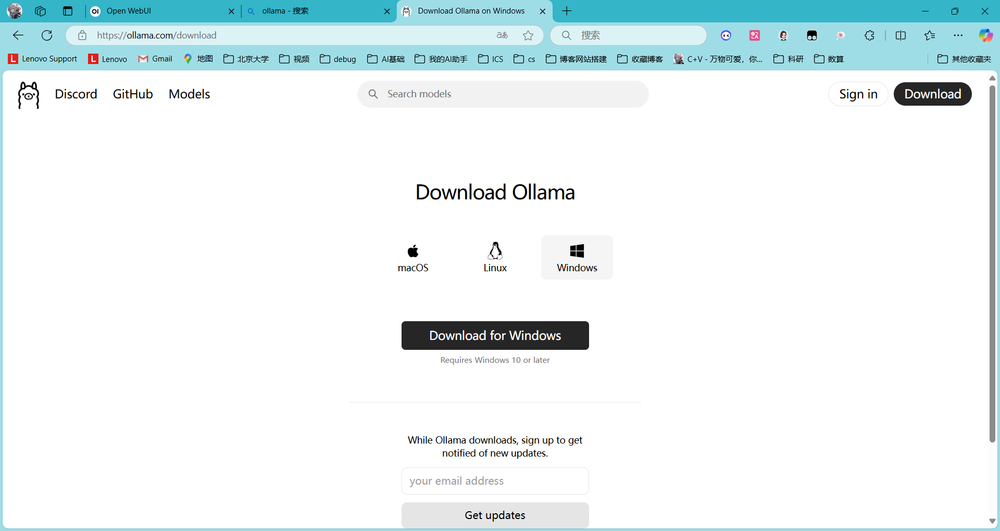
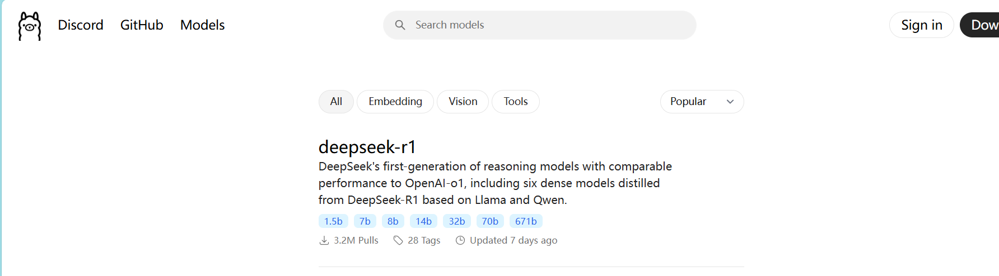
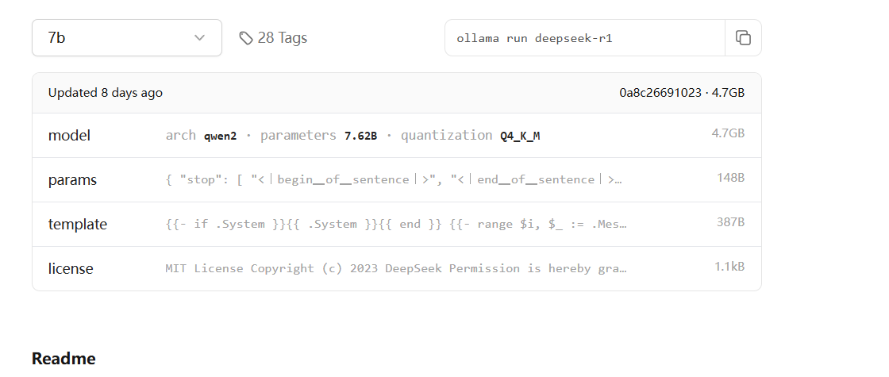
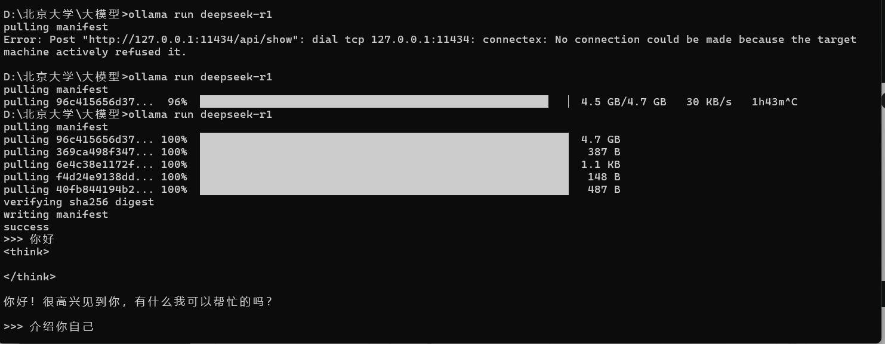
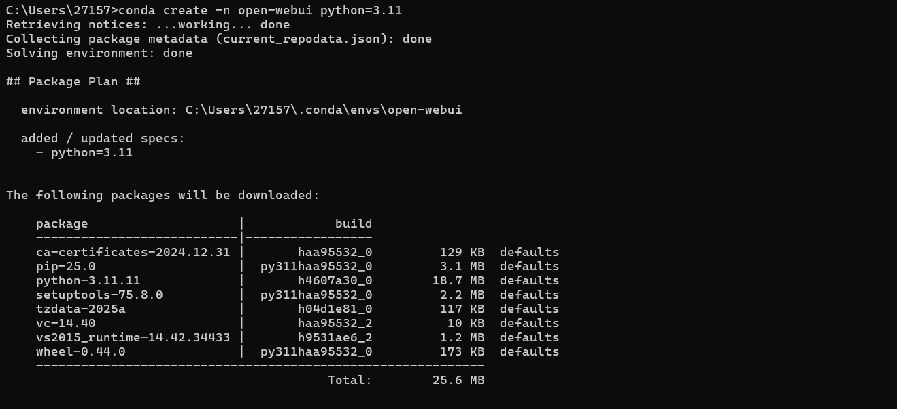
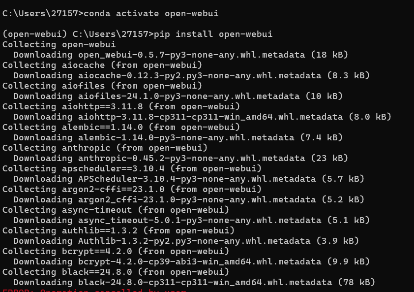
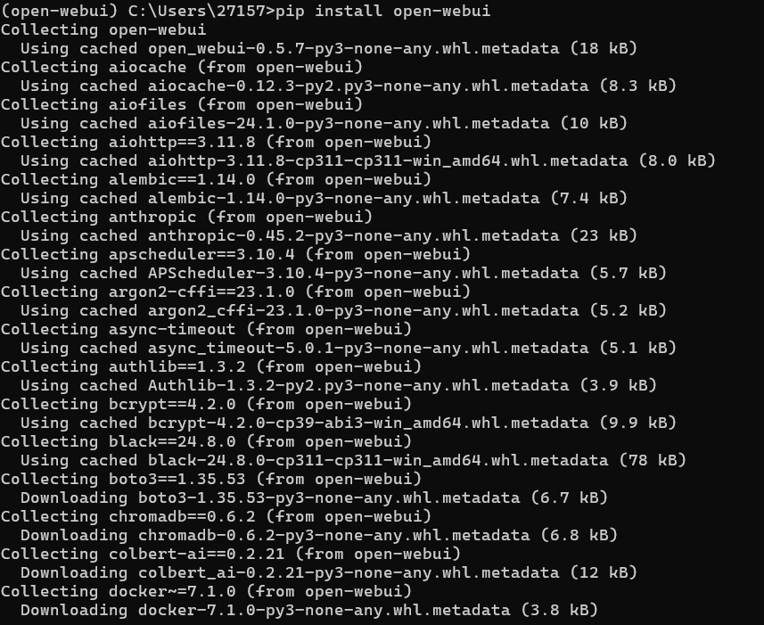
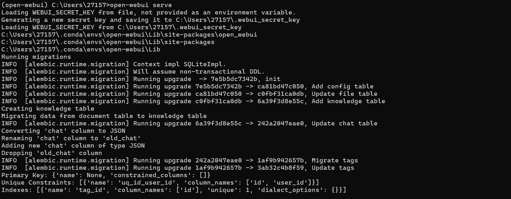
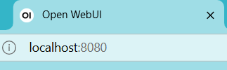
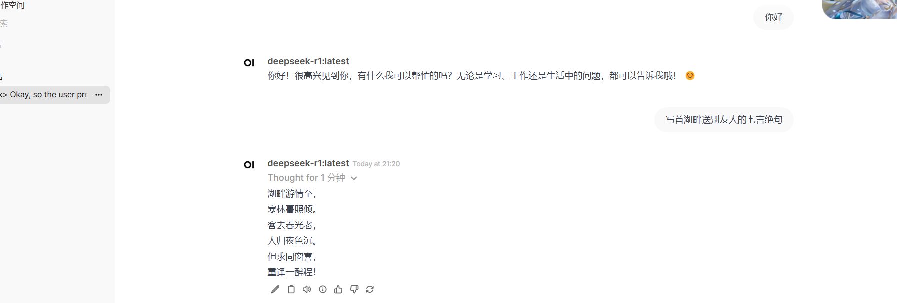

# 第一步：下载Ollama

直接下载就ok了，下载完成后进行安装就可以了

# 第二步：本地下载deepseek r1模型

这一步好像不开梯子会更快

在Models里找到deepseek

选择合适的参数量级，复制指令右端的指令

然后再找到一个合适的文件夹，打开终端，输入指令，等待下载完成

这样就可以成功地在终端进行问答了

# 第三步：安装ui（可选，方便管理而已，另外好看）

首先需要安装conda（这个自己找教程吧，挺多的网上）

注意开梯子

## 创建conda 环境

## 激活conda环境

## 安装ui

==开梯子（敲黑板）==

## 运行ui

如果没有自动弹出浏览器，可以手动输入网址

# OK了，成果展示：

