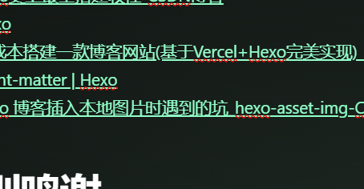




基于`hexo+github+butterfly`的个人博客网站111


# 依赖项目

- 本站采用`hexo`框架

  hexo 是一款快速、简洁且高效的博客框架。[Hexo](https://hexo.io/zh-cn/)

- 本站采用`github`托管,没有后端服务器
- 本站采用基于`butterfly`的`anzhiyu`主题
- 本站评论服务基于`valine`，是一个无后端的评论服务
- 本站数据统记基于`51a`，是一款先进的网站数据统计服务
- 本站实时聊天基于`Chatra`，是一款免费的实时聊天服务

# 搭建指南（踩坑记）



`Hexo`是一款基于`Node.js`的静态博客框架，依赖少易于安装使用，可以方便的生成静态网页托管在`GitHub`，[Hexo](https://hexo.io/zh-cn/)官方网站。因为Hexo的创建者是台湾人，对中文的支持很友好，可以选择中文进行查看。

## 安装`Git`

廖雪峰老师的Git教程写的非常好，大家可以了解一下。[Git教程](https://www.liaoxuefeng.com/wiki/0013739516305929606dd18361248578c67b8067c8c017b000)

windows：到git官网上下载,[Download git](https://gitforwindows.org/),下载后会有一个Git Bash的命令行工具，以后就用这个工具来使用git。

安装好后，用`git --version` 来查看一下版本

## 安装`node.js`

参考这篇博文[2024最新版Node.js下载安装及环境配置教程【保姆级】_nodejs下载-CSDN博客](https://blog.csdn.net/WHF__/article/details/129362462)

注意，本人踩的坑:

- 建议装的D盘里，并记住下载地址
- 安装后，右键文件夹，点击属性，把权限全部给它，否则只能在管理员的`cmd`窗口操作
- 若安装后无法使用，建议卸载重新装[Windows系统完全卸载删除 Node.js （包含控制面板找不到node.js选项情况）_windows卸载node-CSDN博客](https://blog.csdn.net/xuezhe5212/article/details/138579159)

## 安装`hexo`

前面`git`和`nodejs`安装好后，就可以安装`hexo`了，你可以先创建一个文件夹blog（建议装到D盘哦，记住位置！），然后通过`cmd`窗口`cd`到这个文件夹下（或者在这个文件夹下直接右键git bash打开）

输入命令

```cmd
npm install -g hexo-cli
```

依旧用`hexo -v`查看一下版本

至此就全部安装完了。

接下来初始化一下`hexo`

```
hexo init myblog
```

- `node_modules`:依赖包，注意，你装的所有插件都在这里
- `public`:存放生成的页面
- `source`:源码，用于生成`public`文件
- `themes`：主题
- `_config.yml`:博客的配置文件

然后再你的`myblog`目录里运行

```
hexo generate
hexo server
```

然后会出现一个链接，`crtl`+鼠标左键点击就可以进去

这个链接只是预览，仅仅在本地访问有用，用的是你自己的电脑做的服务器。


## `GitHub`创建个人仓库

登录后，在`GitHub.com`中看到一个`New repository`，新建仓库


创建一个和你用户名相同的仓库，后面加`.github.io`，只有这样，将来要部署到`GitHub page`的时候，才会被识别，也就是`xxxx.github.io`，其中`xxx`就是你注册`GitHub`的用户名。一定要注意必须是这样才可以被识别

## 生成`SSH`添加到`GitHub`

回到你的git bash(myblog根目录)中，


```
git config --global user.name "yourname"
git config --global user.email "youremail"
```

这里的`yourname`输入你的`GitHub`用户名，`youremai`l输入你`GitHub`的邮箱。这样`GitHub`才能知道你是不是对应它的账户。

可以用以下两条，检查一下你有没有输对

```cmd
git config user.name
git config user.email
```


然后创建SSH,一路回车

```
ssh-keygen -t rsa -C "youremail"
```


这个时候它会告诉你已经生成了.ssh的文件夹。在你的电脑中找到这个文件夹。

`ssh`，简单来讲，就是一个秘钥，其中，`id_rsa`是你这台电脑的私人秘钥，不能给别人看的，`id_rsa.pub`是公共秘钥，可以随便给别人看。把这个公钥放在`GitHub`上，这样当你链接`GitHub`自己的账户时，它就会根据公钥匹配你的私钥，当能够相互匹配时，才能够顺利的通过`git`上传你的文件到`GitHub`上。

而后在`GitHub`的`setting`中，找到`SSH keys`的设置选项，点击`New SSH key`
把你的`id_rsa.pub`里面的信息复制进去。

在`gitbash`中，查看是否成功

```
ssh -T git@github.com
```

## 将`hexo`部署到`GitHub`上

这一步，我们就可以将hexo和GitHub关联起来，也就是将hexo生成的文章部署到GitHub上，打开站点配置文件 `_config.yml`，翻到最后，修改为
`YourgithubName`就是你的`GitHub`账户

```cmd
deploy:
  type: git
  repo: https://github.com/YourgithubName/YourgithubName.github.io.git
  branch: master
```

这个时候需要先安装`deploy-git `，也就是部署的命令,这样你才能用命令部署到`GitHub`。

```cmd
npm install hexo-deployer-git --save
```


然后

```
hexo clean
hexo generate
hexo deploy
```


`hexo clean`是清除你之前生成的东西（也就是`public`文件夹），建议加上

`hexo generate`是生成新的`public`，可以用`hexo g`但在主题配置中和其他命令冲突，建议用`hexo generate`

`hexo deploy`就是把`public`推到网页上。可以用`hexo d`缩写

`注意`：这只是创建网页，在之后要推送文章时，要在`hexo d`使用`hexo server`预览，看看和自己写的一样不一样，不一样再`hexo clean`后重新写，一样后，在`cmd`窗口中，`crtl+c`停止运行`hexo server`后再运行`hexo d `

注意deploy时可能要你输入username和password。

部署成功后，过一会儿就可以在`http://yourname.github.io` 这个网站看到你的博客了！！


## 至于安装主题

我用的是安知鱼主题，详细参考这个博文[主题安装 | 安知鱼主题官方文档 (anheyu.com)](https://docs.anheyu.com/initall.html)

主题配置不简单，建议仔细阅读文章后操作

## 参考博文

[hexo史上最全搭建教程-CSDN博客](https://blog.csdn.net/sinat_37781304/article/details/82729029?ops_request_misc=%7B%22request%5Fid%22%3A%22172457961016800182780477%22%2C%22scm%22%3A%2220140713.130102334..%22%7D&request_id=172457961016800182780477&biz_id=0&utm_medium=distribute.pc_search_result.none-task-blog-2~all~top_positive~default-1-82729029-null-null.142^v100^pc_search_result_base8&utm_term=hexo&spm=1018.2226.3001.4187)

[Hexo](https://hexo.io/zh-cn/)

[零成本搭建一款博客网站(基于Vercel+Hexo完美实现)【保姆级教程】_vercel博客-CSDN博客](https://blog.csdn.net/weixin_52908342/article/details/135173988?ops_request_misc=%7B%22request%5Fid%22%3A%22172456593816800207071301%22%2C%22scm%22%3A%2220140713.130102334.pc%5Fall.%22%7D&request_id=172456593816800207071301&biz_id=0&utm_medium=distribute.pc_search_result.none-task-blog-2~all~first_rank_ecpm_v1~rank_v31_ecpm-2-135173988-null-null.142^v100^pc_search_result_base8&utm_term=采取vercel%2Bhexo%2Bgithub搭建&spm=1018.2226.3001.4187)

[Front-matter | Hexo](https://hexo.io/zh-cn/docs/front-matter)

[hexo 博客插入本地图片时遇到的坑_hexo-asset-img-CSDN博客](https://blog.csdn.net/s_alted/article/details/138582550?ops_request_misc=&request_id=&biz_id=102&utm_term=hexo博客中插入图片&utm_medium=distribute.pc_search_result.none-task-blog-2~all~sobaiduweb~default-3-138582550.142^v100^pc_search_result_base8&spm=1018.2226.3001.4187)（注意把存放md文档的图片的文件夹设置成和md文档同名）

# 特别鸣谢

[Arthals' ink - 所见高山远木，阔云流风；所幸岁月盈余，了无拘束。](https://arthals.ink/)（卓佬，我永远的神！）

---

本站耗费五天时间，踩了无数的坑才搭建完成，本站除去域名是零花费，适合想搭建个人博客网站而且预算不高的同学（其实域名三年我也才花了79软妹币）。

一款无后端的静态`hexo`个人博客网站，你值得拥有！
